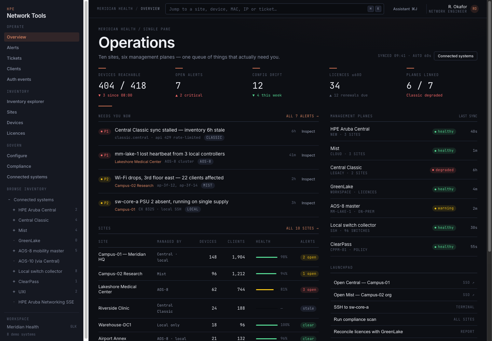
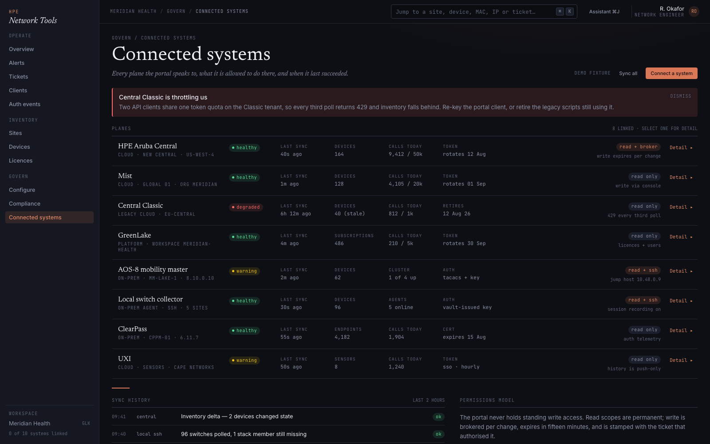
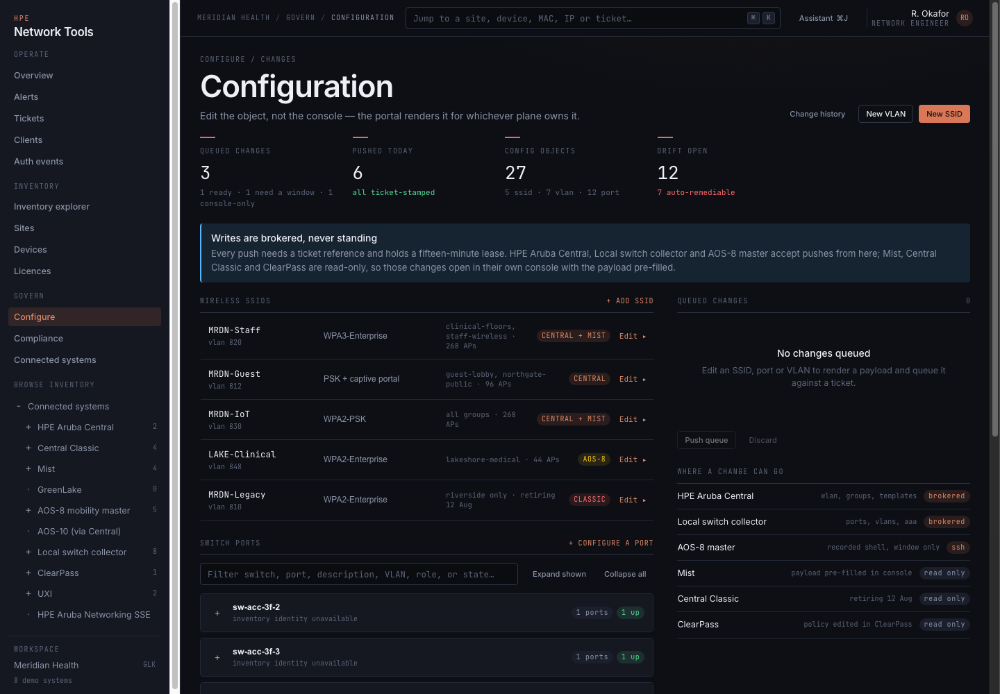
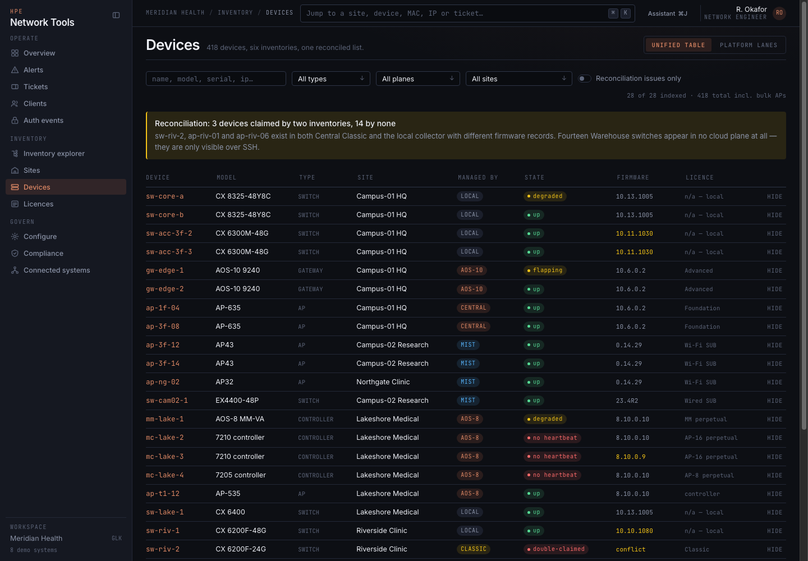
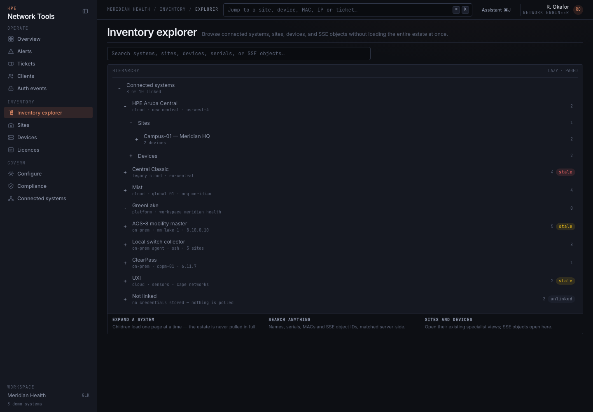

# HPE Network Tools

HPE Network Tools is a multi-plane network operations portal for inventory,
clients, topology, configuration, diagnostics, and connected-system management.
It combines HPE Aruba Networking Central, Central Classic, GreenLake, ClearPass,
UXI, Mist, HPE Aruba EdgeConnect SD-WAN, HPE OpsRamp, local switches, and
HPE Aruba Networking SSE in one interface.



## Highlights

- Unified devices, sites, clients, alerts, licences, and topology across 12 planes.
- Lazy Inventory Explorer for systems, sites, devices, and SSE objects.
- Estate-wide Topology screen merging every plane's reported neighbour facts — per-edge provenance, ghosts for unresolved neighbours.
- Responsive desktop navigation and a focus-managed mobile drawer.
- Collapsed switch groups that keep large port inventories out of the initial DOM.
- Exact device targeting by management plane and serial number.
- SSID creation, editing, and scope assignment (Central and AOS-8 config drift).
- Mist SLE scores surfaced per-site alongside device and client counts.
- Mist rogue and neighbour AP detection per site — the on-your-wire finding leads.
- ClearPass endpoint repository with auth-events feed.
- Reviewed ClearPass direct writes — endpoint register/edit and local-user create/edit, passwords write-only.
- UXI sensor fleet with inline issue detail.
- AP and AOS-CX traceroute diagnostics with bounded background polling.
- HPE Aruba Networking SSE inventory and reviewed CRUD with Commit handling.
- Central webhook management with one-time HMAC-key handoff.
- Recorded, allow-listed SSH terminal sessions for locally managed devices.
- Versioned running-config backups with drift diffs on Compliance.
- Alert dedup with ×N grouping and time-boxed, reason-required silences.
- Outbound alert notifications to Slack, Teams, ntfy, or a generic webhook — HMAC-signed, with a demo outbox that never dials.
- Device-down alert rules (baseline-seeded, cooldown-gated, managed on the Alerts screen) feeding an in-app notification bell with unread badge and mark-read.
- Scheduled fleet summary reports by email (SMTP with STARTTLS) plus a 90/60/30/15-day expiry ladder over subscriptions and watched TLS certificates.
- Central DPI application visibility per site: risk watchlist, top talkers, and category rollup, with byte totals honestly labelled as estimates.
- Scheduled maintenance windows plus HMAC-verified inbound Mist/Central webhook receivers feeding the same deduped queue.
- Faceted filters, saved views, per-table column manager, and keyboard-driven rows on the big tables.
- Clickable overview stat tiles and quick time ranges on the auth-events feed.
- Central and Mist region pickers with full cluster/region lists.
- EdgeConnect Orchestrator API key support (preferred for automation).
- SSO via OpenID Connect (Authentik or any OIDC provider).
- Demo, live, blended, and per-screen data-source controls.

## Connected systems

| Plane | What is pulled |
|---|---|
| HPE Aruba Central | Devices, sites, clients, alerts, config, licences |
| Central Classic | Devices, sites, clients via Classic gateway |
| HPE GreenLake | Subscriptions and workspace inventory |
| HPE Aruba Mist | Devices, clients, alarms, SLE scores, WLAN templates |
| HPE ClearPass | Auth events, endpoint repository |
| HPE UXI | Sensor fleet and test results |
| HPE Aruba AOS-8 | Devices, clients, SSID profiles |
| HPE Aruba AOS-CX | Local switch inventory via REST |
| HPE Aruba EdgeConnect | SD-WAN appliance inventory and alarms (API key or username/password) |
| HPE OpsRamp | Resource inventory and alert feed |
| HPE Aruba SSE | Connector and object inventory |
| Local | Locally managed switch inventory |

## Quick start

Requirements: Node.js 20 or 22 and npm.

```bash
git clone https://github.com/secure-ssid/HPENetworkTools.git
cd HPENetworkTools
npm install
npm run dev
```

Open [http://localhost:5173](http://localhost:5173). The default configuration
uses demo data and does not require network-system credentials.

The normal development command also uses one HTTP listener: Vite rebuilds
assets in watch mode without opening a second web port, and Express serves the
UI, API, and terminal WebSocket together on `5173`.

For a production build:

```bash
npm run build
npm start --workspace server
```

Open [http://localhost:5173](http://localhost:5173).

## Assistant providers

The Assistant is configured in **Connected systems → Assistant**. Its six
provider choices deliberately start disabled; enable and save the provider you
intend to use, select it as the active provider, then use **Test provider**.
The saved active provider is the only provider used for a chat request unless a
request explicitly selects another configured provider.

| Provider | Speed-first default |
|---|---|
| Codex CLI | `gpt-5.6-terra`, low reasoning effort |
| Claude CLI | `sonnet`, low reasoning effort |
| Kimi CLI | `kimi-code/kimi-for-coding-highspeed`, thinking off |
| GitHub Copilot CLI | `auto`, adaptive effort |
| Ollama | `http://127.0.0.1:11434/v1`, `qwen2.5-coder:7b` |
| OpenRouter | `https://openrouter.ai/api/v1`, `openai/gpt-4.1-mini` |

Ollama is the default active selection for a new configuration, but it is also
disabled until configured. A green provider status is meaningful only when the
provider is installed, authenticated, has a usable model, and its isolated
test has completed exactly one read-only `centralmcp` invocation. Discovering
an executable alone is not readiness. A provider that cannot make that
isolated `centralmcp` read remains unavailable; correct its installation,
authentication, model configuration, or MCP endpoint and retest it.

The Assistant is read-only by default. Enabling **Allow write tools** in
Connected systems → Assistant is necessary but not sufficient: each chat
session must also explicitly allow writes before a destructive `centralmcp`
tool is exposed. Existing portal write flows retain their own review and
confirmation gates; enabling Assistant writes never bypasses them.

## Documentation

| Guide | Purpose |
|---|---|
| [Installation](docs/installation.md) | Install, run, update, and configure runtime paths |
| [Configuration](docs/configuration.md) | Data modes, connected systems, credentials, and scopes |
| [User guide](docs/user-guide.md) | Daily navigation, SSIDs, diagnostics, SSE, and webhooks |
| [Security](docs/security.md) | Secret handling, reviews, recovery, and operational safeguards |
| [Design reference](docs/design-reference.md) | Archived interface specification and design notes |

## Screenshots

### Connected systems



### Configuration



### Device inventory



### Inventory explorer



## Project layout

```text
HPENetworkTools/
├── design/               Archived HTML design prototypes and research notes
├── docs/                 Installation, configuration, usage, and screenshots
├── scripts/              Smoke-test runner
├── server/               Express API, adapters, services, routes, and tests
├── shared/               Shared contracts, fixtures, and domain logic
├── web/                  React application, components, screens, and tests
├── data/                 Local runtime state and credentials (git-ignored)
├── package.json          npm workspace scripts
└── README.md             Project entry point
```

## Validation

```bash
npm run typecheck
npm run lint
npm test
npm run build
bash scripts/smoke.sh
```

Never commit `data/settings.json`, API tokens, client secrets, private keys, or
one-time webhook HMAC keys.
