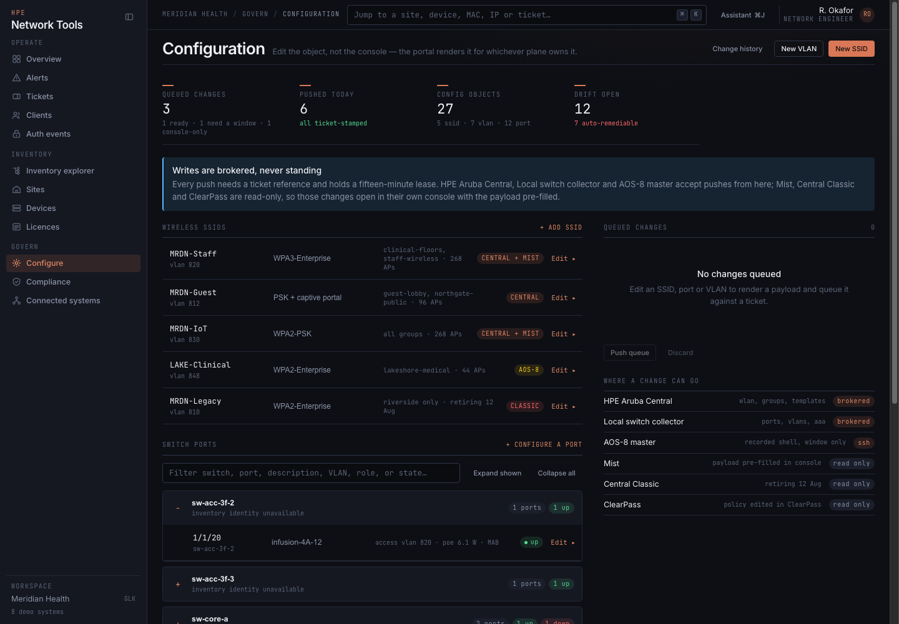

# User guide

## Navigation

The desktop navigation is grouped by task (object-first rail):

- **Operate:** Overview, Alerts, Topology, Tickets, Clients.
- **Estate:** Sites, Devices, Inventory explorer, Auth events.
- **Change:** Configure, Compliance, **Recommendations**, Licences.
- **Platforms:** Connected systems, Central, Mist, ClearPass, UXI, GreenLake
  (collapsed by default — expand the group or open a plane route to show brands).

**Recommendations** (`/recommendations`) is the full-page, shareable surface for
read-only hygiene suggestions; embedded panels on detail screens deep-link here.
**GreenLake**, **ClearPass**, and **UXI** live under Platforms with the other
plane consoles. Configuration for Central and Mist stays under Connected systems.

The two richest planes also have their own operational screens. **Central**
(at `/central`) gathers the plane's fleet stats, per-site health, firmware
verdicts, WLAN summary, its alert slice, and site-picked application
visibility. **Mist** (at `/mist`) gathers SLE scores across sites, rogue and
neighbor APs, AP radio and power health, WLANs, firmware, licence usage, and
the org audit log with webhook-registration status.

The **Assistant** is a chat drawer over the estate, opened from the topbar or
with ⌘J (Ctrl+J on other platforms). It answers through a configured MCP
server and OpenAI-compatible LLM — set both under **Connected systems →
Assistant**; until then the panel says so instead of guessing. Tools stay
read-only unless the server-side write mode and the panel's own per-session
switch are both on. The archived [design reference](design-reference.md)
carries the panel's design notes.

Browsing the estate itself happens on the **Inventory Explorer** page rather
than in the sidebar, so the hierarchy gets the full width of the screen instead
of a 236px column.

At tablet and phone widths, use **Menu** to open the focus-managed navigation
drawer. Escape, the close control, or selecting a destination closes it.

Above the page chrome, the **Shift strip** stays visible on every screen: workspace
name, Live/Demo/Offline mode, a **P1** chip that jumps straight to the Alerts queue
filtered to criticals (`/alerts?sev=P1` — Loop 134), a planes-health chip that
jumps to Connected systems, and freshness as a relative age (**Fresh 4m ago**)
with the clock time on hover. A polite live region restates mode, P1 heat, plane
health, and freshness for assistive tech without stealing focus. When a linked
plane **enters or leaves degraded** between polls, a second polite region
announces the delta (for example “central became degraded”) so operators hear
*what* changed without re-reading the whole strip (Loop 131). When an operator
pins an alert → device → ticket path, the **Incident strip** (spine) keeps that
context visible while moving across screens — **Open device**, **Back to source**,
**Tickets**, or **Clear**.

Use the search field (⌘K / Ctrl+K) to jump to **screens by name** (type
`alerts`, `go licences`, `recs`, `connected systems`, … — screen hits sort above
estate results), and to systems, sites, devices, SSE objects, clients, IP
addresses, MAC addresses, or tickets. Type **raise ticket**, **silence** /
**hush**, or **traceroute** / **run diagnostic** for first-class **quick
actions** (Loop 131) that deep-link into the Alerts queue, Silences workflow, or
Devices with a one-shot operator cue (`?action=ticket|silence|diagnostics` is
consumed on landing so Copy view link stays filter-only). If the estate search
fails, the panel says **Inventory search unavailable** with the reason — it
does not pretend nothing matched.

On the overview, each stat tile links to the screen whose list its number
summarises — devices, alerts, compliance, licences, or connected systems. The
Sites preview accepts the same `?health=ok|warn|bad|stale` filter as the Sites
list; **Copy view link** and the section hand-off keep that health slice.

When metrics history has at least two samples across ~one hour, Overview also
shows an attention strip under the stat tiles: chips for downs recovered or
added, alert count change, and device/client deltas. When the Overview stats
include a non-zero **Licences ≤60d** count, a **licences ≤60d** chip joins the
strip and jumps to Licences — even if metrics cannot form an hour delta. Each
chip jumps to the matching list. Hour chips are sample math only — never a
prediction — and stay hidden when the metrics envelope is missing or too short
to compare (the licence chip can still appear alone).

The topbar **Dark / Light** control toggles `html[data-nd-theme]` (stored as
`hpe-nt.theme`). Table density from **Connected systems → Portal** also sets
`html[data-nd-density]` so shell chrome follows Comfortable / Compact.

The overview's plane list carries a sparkline per linked plane — devices
reported, sampled every five minutes and retained for 24 hours. A sample the
server flags as unusual for that series (a robust median/MAD z-score over what
the portal retained — statistics over kept samples, never a prediction) is
dotted in the warning tone, and the panel caption then says what the dots mark
and the window they were judged against. A series with too few samples to
judge, or an older server that computes no flags, renders no dots.

Lists that would otherwise repeat the same empty row many times collapse
instead. Connected systems, the Inventory Explorer tree, the overview rail and
Configure all group the planes that hold no credentials behind one line such as
`8 systems not linked`. Select that line to expand the full set; nothing is
hidden permanently, and nothing is filtered away.

## Inventory and topology

Inventory Explorer follows:

`connected system → site or object kind → device or object`

Branches load only when expanded. Expanded node ids write into `?exp=`
(comma-separated) beside the selected `?node=` so **Copy view link** restores
the same open hierarchy. The estate search box also writes `?q=` once the query
is at least two characters, so a shared link reopens the same search (short or
cleared queries drop the param). A search that matches nothing offers **Clear
search** (Loop 204). Search hits narrowed by a `?ids=` selection deep link that
matches nothing offer **Clear selection filter** (Loop 208). Statuses distinguish current, stale, denied,
unsupported, failed, empty, and unlinked data. Device links retain their
management plane and serial identity.

The device inventory reconciles devices from multiple management planes.
Device actions use the management plane and serial number, not only the display
name. Duplicate names therefore do not silently target the wrong device.

A `/devices?state=<state>` link narrows the inventory to one exact state —
useful for sharing a filtered view, such as every device currently down. While
it applies, the filter shows as a clearable chip next to the other filters. A
**Type** chip row (counts over issues+q+names+state — Loop 153) toggles the
same `?type=` filter as the header Select; click again to clear. A **State**
chip row (counts over type+q+names+issues — Loop 154) toggles the same
`?state=` param; click again to clear. A `?names=` selection deep link that
matches no devices offers **Clear selection filter** (Loop 214).

**Bulk serial lookup** resolves up to 50 serials in one call
(`GET /api/devices/bulk?serials=a,b&planes=mist,central`). The response lists
matched devices plus any serials that were requested but not found — useful for
paste-from-spreadsheet checks without walking the full inventory page by page.

Site detail shows only topology reported by a connected source. Wired clients
use Ethernet statistics and are not assigned wireless signal values.

The topology diagram has a focus mode: shift+click a card (or plain-click one
with no other action, such as an unmanaged neighbour) to isolate it with its
1-hop neighbours — everything else dims, cards and edges alike. While a focus
is active, clicking another card moves the focus and navigation is suspended;
Esc, the **Exit focus** chip, or a click on the diagram background restores
the full graph. Edge labels word the wiring in the plane's own terms: LAG
member ports with their bundle named (`1/1/1+1/1/2 (Po2)`), a member port the
plane scored as anything but good (`port 1/1/2 flapping`), STP-blocked links,
manually asserted adjacencies, and stack links. **Export CSV** on the site
diagram downloads the **site** view-model only (`site-topology-nodes.csv` and
`site-topology-edges.csv`) — client-side, not the estate topology API.

The **Topology** screen (Operate, after **Overview**) applies the same
honesty estate-wide: one graph over every plane's reported neighbour facts,
built and merged server-side (`GET /api/topology`). An adjacency two planes
report reads as one edge carrying every source's badge, never two guesses;
each edge keeps its provenance — the reporting plane, the evidence word
(LLDP, CDP, VSF, recorded uplink), ports and speed when reported, and a
stale mark when no fresh source still vouches for it. A neighbour that
resolves to no inventory row is a ghost — drawn as reported in a "filed
nowhere" strip, never promoted to a managed device. Sites start collapsed
to one card each and expand on click; shift+click isolates a card with its
1-hop neighbours exactly as the site diagram does, and clicking through
opens the site or the device. The filter bar narrows by text (`?q=`), plane
(`?plane=`), device type (`?type=ap|switch|…` exact match on node class), and
ghosts-only (`?ghosts=1` — **Ghosts** chips + Switch share that write-back,
counts over q+plane+type — Loop 148); **2D/3D** is `?view=2d|3d`
(when the URL omits `view`, the screen writes the resolved default —
WebGL → `view=3d`, otherwise `view=2d` — so refresh and share match the
canvas) and focus is `?focus=site:ID` or `?focus=node:ID`. **Copy view link**
puts those params on the clipboard. **Export CSV** dumps the filtered on-screen graph;
live mode also offers **Download server CSV (nodes)** and **Download server
CSV (edges)** against `GET /api/topology/export?part=nodes|edges` and passes the
active `q` / `plane` / `type` / `ghosts` filters so the server file matches the drawn
slice (reported facts only — site detail never calls this estate path). Below the
graph, a **Nodes** table multi-select raises **Export selected**, **Copy serials**
(unique newline-joined inventory serials), **Copy names** (unique newline-joined
node names when serials are sparse — Loop 223), **Copy selection link** (`?ids=` of
marked node ids; clearable chip — Loop 186), and **Clear**. A `?ids=` deep link
that matches no nodes offers **Clear selection filter** (Loop 208). Live mode says where
the edges came from in the footer notes: the only poll-carried neighbour
dataset today is Mist's AP-stats LLDP walk, so Central site graphs and AOS-CX
port neighbours stay per-site on-demand reads — open a site for its own graph.

For Mist sites, site detail also offers two deeper views. A floor plan section
renders the site's Mist map with AP and client dots at their reported
positions; a site with no map uploaded says so (floor plans are uploaded in
the Mist dashboard) rather than showing a placeholder. The wireless experience
section lists the site's SLE metrics; clicking one opens a drill-down with
classifiers, impacted clients and APs, and a trend sparkline — each part
fetched on demand and honestly labelled when the org does not score it.
**Copy section link** shares `?section=sle` on the site URL; with a drill open,
**Copy drill link** adds `&metric=<wire-name>` so a colleague reopens the same
drawer (`?section=sle&metric=coverage`). Closing the drawer drops `metric`
while keeping the section. **Export CSV** dumps the metric scores and impact
counts (`site-sle-<id>.csv`); the open drill offers **Export drill CSV** for
classifiers and impacted clients/APs.
Topology edges reported by an AP's own LLDP neighbour table (for example an
AP uplinking to a CX switch port) are drawn with that provenance.

Site detail also carries a **Rogue & neighbor APs** section: the BSSIDs the
site's APs hear, from Mist's per-site insights report — the only plane that
publishes one, read as one budget-gated walk per site on the poll. The
on-your-wire flag is the alarm half: a rogue whose BSSID resolves to your
wired infrastructure leads the section under a danger callout, because a
rogue on your own wire is the finding to act on and everything else is only
in earshot. Rows sort on-your-wire first, then strongest signal, each with
its SSID (or "SSID not broadcast"), BSSID, channel, signal, and how many of
the site's APs heard it. **Copy section link** shares
`?section=rogues#rogues` (available even when nothing was heard). **Export CSV**
downloads that sorted site-scoped list (`site-rogues.csv` —
BSSID/SSID/channel/RSSI/numAPs/on-wire; no secrets). Multi-select raises
**Export selected**, **Copy BSSIDs**, **Copy names** (unique newline-joined
broadcast SSIDs when BSSIDs alone are sparse — Loop 235), and **Copy selection
link** (`?bssids=` + `section=rogues`; clearable chip — Loop 193). Selection-empty
`?bssids=` offers **Clear selection filter** (Loop 220). Live mode also offers
**Download server CSV** → `GET /api/sites/{siteId}/rogues/export` (same columns
plus `siteId`; empty file = nothing heard). A row whose flag the report
did not carry reads "not reported", never an assumed safe. A Mist site with
nothing in earshot says so as a real answer, not a failed read; a site no plane
publishes a rogue report for says that instead; a walk that failed is reported
unavailable — never a fabricated all-clear.

For a Central-claimed site, site detail also carries an **Application
visibility** section: the site's DPI application table, read on demand for
the last 24 hours (the Central endpoint refuses a window wider than 7 days).
It opens with the risk strip — suspicious, moderate, low, trustworthy,
unknown, zero counts included — then the watchlist (flagged apps split into
the unclassified ones the plane could not name and the classified ones), the
top talkers ranked by estimated bytes, and a category rollup whose bars are
shares of the *largest* category, never of the total — an app's bytes count
toward every category it carries. Byte totals are DPI estimates, and the
section says so verbatim: "DPI byte totals are estimates — read as a ranking,
not a measurement". The table pages at 200 rows a call against a metered
plane, so it is fetched only when the section opens for a Central-claimed
site; any other site says "not reported" without spending a call.
**Copy section link** shares `?section=applications#applications`. **Export CSV**
(and live **Download server CSV**) dump the loaded DPI table only — never secrets.

Opening a Mist AP in the device detail shows its RF and health panel: per-band
channel, power, noise floor and airtime utilisation split, CPU and memory,
uplink port counters, power source with a constrained flag, and environment
readings where the hardware has sensors (an AP without them says "not
reported", never zero). The devices table marks firmware that is behind the
org's recommended train with the target version; wired Mist clients appear in
the Clients screen with their switch port instead of wireless readings.

Opening one client in the Clients screen shows a Client 360 section: every
management plane's own answer for that MAC — its session rows, the ClearPass
endpoint profile and recent auth decisions, Mist site SLE (labelled as
site-level, not per-client), and the site's top applications by DPI bytes —
site-wide, not filtered to the client: Central does not narrow that table to
one client, and the line says so. Planes with nothing to report say why (not
linked, no roster this cycle, no per-client view) rather than staying silent.

The **ClearPass** screen organises the box behind a tab strip. **Endpoints**
is the profiled repository — rows carry their description and Device Insight
tags when the CPPM reports them — and **Auth events** is its RADIUS feed.
Behind those sit the policy inventories: **Network devices** (the NADs that
authenticate to it), **Auth sources**, **Roles**, **Enforcement** (policies,
each with its default profile resolved to the profile row it names — type and
description shown when the name resolves), **Local users** (whitelisted
identity fields only — no password material), and **Services** (which also
lists device groups). Every tab keeps three states distinct: reported rows, a
real empty answer, and "not reported by this CPPM". Services and device
groups are not exposed on every CPPM build; when the box 404s them their
sections say "not available on this CPPM" — stated, never an empty table.
**Copy filter link** (and the address bar) carry `?tab=` for the active strip
plus endpoint `q` / `status` / `category` when set — default **Endpoints**
omits `tab` so a bare `/clearpass` stays the repository view. Endpoints
multi-select raises **Export selected** and **Copy MACs**; Services multi-select
raises **Export selected**, **Copy names** (unique newline-joined service
names — Loop 174), and **Copy selection link** (`?services=` + `tab=services`; clearable chip — Loop 181). Live **Download server CSV** hits `GET /api/clearpass/export`
with the same filters and sets `part=endpoints` on Endpoints (or
`part=sessions` on Auth events / `part=services` on Services) so the file
matches the strip you are on.

The **Endpoints** and **Local users** tabs also write — the only two CPPM
datasets the portal touches; services, enforcement policies, and roles stay
in ClearPass. **Register endpoint** adds one MAC (normalised however it was
typed, with an optional description, a status — Known, Unknown, or
Disabled — and profiler-style attribute hints); a per-row edit changes the
status and/or the operator note, never the MAC. **Add local user** creates
one with a login, a display name, a role from the reported role inventory,
and an enabled flag; the per-row edit offers the same fields plus a
password reset. Every write runs the reviewed direct-write flow the SSID
editor set: an exact summary, the review checkbox as the authorisation (no
ticket), then apply, read-back verification, and one audit-log line in the
change log. Local-user passwords are write-only end to end — never logged,
audited, echoed, or read back. Demo mode validates and answers a labelled
success without sending anything; live mode re-reads the screen after a
landed write and says so when the refresh could not confirm the lists are
current.

On AOS-CX switches, the device detail port table also carries live traffic
counters (rx/tx bytes and packet error/drop counts) read from the switch's
REST interface statistics. A counter the switch did not report shows as "not
reported", never as zero.

Opening a Central-managed switch or AP in device detail shows a **Hardware
trends** panel, read on demand for that one device — never on the poll —
over a window of 1h, 6h, 24h (the default), 3d, or 7d. A switch gets stat
tiles for CPU, memory, system temperature, and PoE draw against its budget,
each captioned with the timestamp of its latest sample rather than posing as
a live reading; sparklines that break the line wherever samples are missing;
and the interface error counters — each counter that moved earns a row with
its window total, while counters that all stayed at zero are stated once,
together. An AP gets CPU, memory, and throughput trends, each metric with its
own outcome line. A device no claiming plane can answer for says "not
reported" in words. **Export trends** downloads metric key, timestamp, and
value only — never claim codes or config bodies. Device and client detail
headers also offer **Copy view link** and **Export summary** (inventory
fields only — never claim codes, passwords, or running-config bodies). Device
detail also offers **Export clients** on the attached-sessions sub-table and
**Export ports** when the class block has port rows. Device
detail Configuration tabs share via `?tab=running|diff|history` (default
Running omits the param), so **Copy view link** restores the same config pane
alongside `plane`/`serial`. Site detail **Copy view link** can carry a
`?section=` / `#section` deep link (topology, devices, applications, SLE, rogues,
and related panels). On a live backend the header also offers **Download server
CSV** for this site's device inventory via
`GET /api/devices/export?site=<id>` (same `site=` filter as the Devices list —
matches site id or name). Client **Export devices** remains the on-screen
snapshot. The topology diagram also offers its own **Copy view link**
(`section=topology`) beside **Export CSV**.

## Triage the alert queue

Repeated firings of the same problem — same plane, device, and title — collapse
into one row with a ×N badge. The badge counts firings, so a ×3 row is three of
them, and queue totals count firings the same way.

Severity, plane, and site FacetFilter ticks (plus free-text `q`) write into the
address bar. Load more keeps paging the `q` slice (facets stay client-side so
counts stay honest). A filter that matches nothing offers **Clear filters**
(resets q / sev·plane·site facets / unacked / `fps` selection — Loop 204).
**Download server CSV** sends active `q` / `sev` / `plane` /
`site` ticks — comma-separated multi-select is OR within each key — so the full
export matches the filter bar, not only the on-screen page.

To hush a known problem while it is being worked:

1. Open the alert group's **Silence** action.
2. Choose a duration (1 hour, 8 hours, 24 hours, or 7 days).
3. Enter a reason. It is required, audit-logged, and shown wherever the group
   is hidden from.

Silenced groups leave the active queue but are always listed below it under
**SILENCED (N)**, with the reason, the expiry, and an **Unsilence** action —
suppression is never invisible. A silence expires on its own; an expired one
stops applying but stays on file as a record. Silences are stored in
`data/silences.json` and apply in demo and live mode alike.

A group's **Timeline** action (or Enter with the row focused) opens its
**Occurrence timeline**: first firing, deduped repeats, silences raised and
expired, plus the device's audited changes and running-config drift, joined
server-side from the queue, the silence store, the change log, and the config
backups. Times reconstructed from the queue's age strings are marked
approximate (≈); authored and persisted facts carry exact ones. When firings
followed a change within 30 minutes, the drawer adds one correlation sentence
— a statement about times, never a proven cause.

Where a silence hushes a problem being worked, a **maintenance window**
schedules the hush ahead of time — AP firmware staging every night, an ISP
cutover on Sunday morning. The **MAINTENANCE WINDOWS** section on the Alerts
**Policy** tab lists upcoming and active windows with their matchers and
spans; **Copy policy link** shares `?tab=policy`, **Export CSV** dumps the
visible windows client-side (matchers, schedule, span — no secrets),
**New window** opens the create drawer, and each row enables, disables, or
deletes.

A window is one-off (absolute start and end) or weekly (the same wall-clock
span on named weekdays, optionally in an IANA time zone — an end time earlier
than the start runs into the next day). At the window's start the scheduler
raises one ordinary silence — the window's reason stamped on it, ending
exactly at the span's end — so matching, expiry, and the silenced listing run
through the same mechanism as an ad-hoc silence. A group benched by a window
names it (`maintenance window <id>`) instead of offering an Unsilence the
scheduler would undo; deleting the materialized silence overrides the rest of
that occurrence.

A reason is required and audit-logged, and at least one of plane, device, or
title substring must be set (a site narrows those matchers but cannot stand
alone). Expired one-off windows stay on file flagged expired — the record that
suppression was scheduled. Windows are stored in
`data/maintenance-windows.json` and apply in demo and live mode alike; demo
mode adds two authored fixture windows, labelled demo.

## Work a ticket

**Tickets** (`/tickets`) is one queue and one workspace. Selection lives in
`?sel=<ticketId>`; the search box writes `?q=` (id/title/site/owner/reporter
text), priority/state filters write `?pri=` / `?state=` (`openish` = anything
not resolved), and the site Select writes `?site=` (exact siteName,
case-insensitive) so a colleague can open the same slice — and the same
`q`/`pri`/`state`/`site` ride `GET /api/tickets` so the server page envelope
matches the filter row. Large queues request pages of 50 and **Load more** via
`page.nextCursor` (omit `limit` keeps the full envelope for other callers).
**Copy filter link** shares the queue slice (`q`/`pri`/`state`/`site`) without
locking a ticket; **Copy view link** keeps `sel=` plus those filters (Loop 159).
Header **LIVE** stamps pure live and blend feeds alike. A **Priority**
chip row (P1 / P2 / P3 counts over the current q+state+site universe) toggles
the same `?pri=` filter as the header Select — click again to clear. A **State**
chip row toggles `?state=` (counts over q+pri+site), and a **Site** chip row
toggles `?site=` (counts over q+pri+state — Loop 148). **Export CSV**
snapshots the filtered queue currently on screen; on a live backend
**Download server CSV** hits `GET /api/tickets/export` with the same filters
and no page slice (summary fields plus `noteCount` — never operator note
bodies). A half-written note draft clears when you move to
another ticket so it cannot be logged against the wrong id. The screen also
carries a read-only visual-references panel and ticket-workflow configuration
recommendations. An empty queue (or empty filter) says so honestly rather than
inventing rows; filtered empties offer **Clear filters**. Selection-empty
`?ids=` deep links offer **Clear selection filter** (Loop 210). Queue multi-select
also offers **Copy titles** (unique newline-joined titles beside **Copy IDs** —
Loop 229) for paste into a handoff when ticket ids alone are sparse.

## Alert when a device stops reporting

The queue watches what planes report as alerts; a device that silently stops
reporting raises none, so nothing fires. Device-down rules close that gap. A
rule says: alert when a device has been continuously offline for a set number
of minutes, optionally narrowed to one site (id or display name) and one
device type (switch, ap, gateway — absent means all), with a cooldown that
keeps a *different* outage of the same device quiet after an alert.

The **Device-down rules** section lives on the Alerts **Policy** tab
(`?tab=policy` deep-links it; **Copy policy link** puts that URL on the
clipboard). Every rule is listed with its scope and thresholds, an enabled
switch per row, **New rule**, a per-row **Edit**, and **Delete** behind a
confirm drawer — a deleted rule stops paging for devices nothing else
watches, so the click cannot be the decision. **Export CSV** dumps the
visible rules client-side (id, enabled, filters, minutes — no secrets; there
is no separate server export). The create/edit drawer (site filter, device
type, offline and cooldown minutes) validates with the same function the
route runs, so a refusal names the problem before the round trip in the same
words the 400 would use. Rules are real operator data in demo and live mode
alike — the engine evaluates whichever estate the screen is showing; with
the backend unreachable the authored demo rule stands in, labelled demo,
and creating or changing a rule needs the server.

The REST API remains underneath: `GET /api/alert-rules` lists every rule
(optional `enabled=` / `deviceType=` filters — aliases like `aps`/`sw` accepted);
`GET /api/alert-rules/export` downloads the same filtered set as CSV (Policy tab
**Download server CSV** when the backend is reachable — client **Export CSV**
stays for the visible list, including the labelled demo fallback);
`POST /api/alert-rules` creates one (`offlineMinutes` defaults to 5,
`cooldownMinutes` to 60; both are whole minutes, 1–1440);
`PUT /api/alert-rules/:id` applies a partial edit;
`DELETE /api/alert-rules/:id` removes one. Every mutation is audit-logged.

The engine samples the same device list the screens show, every 60 seconds,
and its judgement calls are conservative:

- First sight is a baseline. A device already offline when first tracked
  never alerts for that outage — its start is unknowable — so pointing the
  portal at a fleet with standing outages pages nobody.
- An outage alerts once. The dedup key names the outage, so the same one
  cannot re-fire and a genuinely new one can.
- A recovery is announced only for an outage that actually alerted — a quiet
  outage ends quietly.
- A device several planes claim is down only when every plane that knows it
  says so.

Fires and recoveries go three places: the notification bell (below), the
outbound webhooks as ordinary fired/resolved transitions, and the change log.
Rules and the per-device tracking state persist in `data/alert-rules.json`,
so a restart neither re-baselines nor re-fires.

### The notification bell

The topbar bell is the in-app notification center: device-down fires and
recoveries land here, plus the subscription and certificate expiry notices
described further down. The badge counts unread entries; the dropdown lists
the newest 15 (the store keeps the last 200 — a feed, not an archive; the
change log is the archive). Clicking an entry marks it read and follows its
link — a device-down entry opens that device's detail page. **Mark all read**
clears the badge. The bell polls every 60 seconds and refreshes when opened;
a backend that stops answering leaves it badge-less and the dropdown says
why, rather than showing a fabricated zero. Demo entries are labelled demo.

## Notify on alert transitions

The queue only reaches the people watching it, so the portal can push
group-level transitions — fired, resolved, escalated — to outbound webhooks.
Open **Connected systems** and scroll to **Notifications** (outbound alert
webhooks), or open the deep link `/systems?section=notifications` (the section
also offers **Copy section link**). Add an endpoint with a name, an HTTPS URL,
a template — generic JSON, Slack, Microsoft Teams, or ntfy — and an optional
HMAC secret.

The notifier watches the same queue the screen shows — a silenced group is
quiet here exactly as it is on screen — and POSTs each transition rendered per
the endpoint's template, signed HMAC-SHA256 in the `x-hpe-signature-256`
header (`sha256=<hex>`, the scheme GitHub webhook receivers already
implement) when a secret is set. Endpoint URLs pass the same SSRF rule as
Central webhook callbacks: HTTPS only, never a private, loopback, or reserved
address — checked when the endpoint is saved and again at send time. The
secret is write-only: the API never serves it back, and clearing one is an
explicit action.

Transitions follow the queue's own rules. A group appearing in the active
queue fires (one arriving already silenced does not). A group leaving the
queue entirely resolves — but a silenced group that clears never paged anyone,
so nobody gets the all-clear. A still-active group whose firing count grew
escalates. The first sample after a server start only baselines what is
already firing, so a boot never re-pages the standing queue. Each endpoint row
keeps its last delivery outcome, HTTP code or transport error included, and
**Test** sends one synthetic event down the real render-sign-POST path — a
green result means the path actually works.

In demo mode nothing is ever sent: would-have-sent payloads land in the
**Demo outbox** below the endpoint list, labelled demo, and the delivery
record says demo, never delivered.

Below the outbox, the **Delivery log** lists live attempt outcomes only
(result, endpoint name, title, HTTP code, error) — never payload bodies,
webhook URLs, or secrets. An empty log says no attempt has been made since
process start; a failed read names the error instead of hiding the section.
Filter by outcome (`delivered` / `failed` / `demo`) and free-text search (`q` on
endpoint / title / error / event kind / fingerprint) in the log toolbar.
**Export CSV** snapshots the rows currently on screen; **Download server CSV**
hits `GET /api/notifications/deliveries/export` (optional `?result=` / `?q=`) for the same outcome-only
columns.

## Send reports by email and watch expiries

The same **Notifications** section of Connected systems carries the email
channel, in three cards below the webhooks.

**Email (SMTP)** holds the one relay configuration: host, port (587 by
default), an optional username, a write-only password (never served back — a
blank field keeps the stored one, the clear checkbox removes it), a from
address, and STARTTLS on or off (off means plaintext, stated plainly for a
loopback relay). **Test** sends one real test email — the default recipient
is the from address — and reports the server's own words. In demo mode
nothing is dialled; the would-have-sent mail lands in the report outbox,
labelled demo.

**Fleet summary report** emails a fleet digest on a schedule: daily, or
weekly on Mondays, at a configured UTC hour (server-local time zones are
deliberately not inherited). A fire must also clear a minimum gap — 20 hours
for daily, 6 days for weekly — so a restart inside the scheduled hour never
double-sends, and a missed window fires at the next one, not every minute.
**Send now** forces a fire that bypasses the clock but not the honesty: no
SMTP relay or no recipients is recorded as skipped with the reason, a failed
send as failed with the server's words, and demo mode renders into the
outbox. **Preview** shows exactly what would send, in any mode — the preview
and the send path share one builder. The subject is
`Fleet Summary Report — YYYY-MM-DD`, and the body carries per-type device
totals, the offline table (first 25, overflow counted), bell alert counts for
the last 24h and 168h, subscriptions expiring within 90 days (first 15,
overflow counted), and a data-gaps section that says what could not be
counted rather than printing a confident zero.

**SSL certificate watch** holds a list of `host[:port]` targets (port 443 by
default, up to 50 hosts). Search the list (`q` on host / port / probe error)
and **Download server CSV** forwards the same filter to
`GET /api/notifications/ssl-hosts/export`. The scheduler probes each host every
six hours — connect, read the certificate's expiry, done; chain verification is
deliberately off, because the question is when the certificate expires, not
whether it is trusted — and a failed probe stays on the row with its error.
**Probe** re-checks one host immediately; demo mode answers without dialling.

Subscriptions (from the licences source) and probed certificate expiries walk
one 90/60/30/15-day ladder: crossing a threshold pushes one bell entry and
one audit-log line, once per band per expiry date. The dedup key names the
expiry date, so a renewal re-arms the whole ladder while a restart re-notifies
nothing. Demo mode adds one labelled demo certificate so the ladder is visible
without credentials.

## Working the tables

The big tables — Devices, Alerts, Clients, Licences, Compliance — share the
same power features. Every `DataTable` carries an accessible name
(`aria-label`) for assistive tech; the compound NightDesk `Table` shell accepts
the same `ariaLabel` prop. Header actions such as **Export CSV**, **Download
server CSV**, and **Copy view link** keep visible text labels (so they already
have accessible names); icon-only chrome elsewhere uses explicit `aria-label`s
(nav rail toggle, notifications bell, sort headers, pagination). Empty and
failed reads stay distinct: a search or ticket-queue failure names the error
instead of looking like "nothing here".

The shared power features:

- **Column manager.** The **View options** dropdown shows, hides, and reorders
  columns; dragging a header edge resizes one. The layout persists per table
  (browser localStorage first, synced into `data/settings.json` when the
  backend answers), and a saved layout that would hide every column is treated
  as corrupt and shows all of them instead.
- **Sorting**, on Clients: every column header is clickable — first click
  sorts ascending, second descending, third clears the sort. A row with no
  value in the sorted column sorts last in both directions, and Session sorts
  by real duration (`2h 14m` outranks `19m`), not alphabetically.
- **Keyboard rows.** On Devices, Alerts, Clients, Auth events, Sites, Topology nodes,
  Licences subscriptions, UXI, ClearPass endpoints, Configure queue, GreenLake
  members, Inventory search hits, Mist estate tables, Central sites/firmware/WLANs,
  Compliance findings, Device detail ports/clients, Site detail devices,
  Overview Needs-you-now/Sites preview, Central webhooks list, and SSE object
  inventory the rows are a
  keyboard grid: `j`/`↓` and `k`/`↑` move between rows, `Enter`/`→` runs the
  focused row's primary action when one exists (open the device, open the
  group's occurrence timeline, open the client, open the site, open a topology
  node, expand a UXI sensor, open an inventory hit, open an Overview site;
  Auth events / Licences / ClearPass endpoints /
  Configure queue / GreenLake members / Compliance findings / Overview alerts /
  Central webhooks / SSE objects
  have no row drill — selection only), `x` toggles its selection, and `Esc`
  clears the selection, then the row focus. Pressing `?` opens the shortcut
  overlay (Topology / Licences / UXI keyboard help is Loop 192; ClearPass endpoints /
  Configure / GreenLake members keyboard help is Loop 195; Tickets keyboard help
  is Loop 196; Inventory / Mist / Central keyboard help is Loop 198; Compliance /
  Device detail / Site detail keyboard help is Loop 199; Overview / Central
  webhooks / SSE inventory keyboard help is Loop 201; ⌘K SearchPanel keyboard
  help is Loop 202; ClearPass services keyboard help is Loop 222). A non-empty selection raises a bulk bar with **Export selected**
  (Devices also offers **Copy selection link**; UXI bulk is Loop 159; Sites bulk is
  Loop 163 + **Copy names** Loop 186; Topology nodes bulk is Loop 186; Recommendations
  bulk is Loop 186; Licences bulk is Loop 162; Compliance findings bulk is Loop 165;
  Overview Needs-you-now + Sites preview bulk is Loop 190 (Needs-you-now **Copy
  titles** Loop 237); Central webhooks list bulk is Loop 190 (**Copy endpoints**
  Loop 237); Mist estate + SiteDetail rogue APs bulk and Mist org audit log bulk
  are Loop 193; GreenLake role grants + locations bulk is Loop 196; Device detail
  ports **Copy neighbours** is Loop 237).
  Rows without a primary action still support `x` selection — Enter simply does nothing honest.
- **Faceted filters**, on Devices and Alerts: checklist popovers (plane,
  state, and site, plus severity on Alerts) with live counts. Ticking is OR
  within a facet and AND across facets, and each count is computed over the
  rows that pass every *other* active filter — ticking P1 never zeroes the P2
  count. A filter that matches nothing offers **Clear filters** (Devices Loop
  202; Alerts Loop 204).
- **Saved views**, on the same two screens: the **Views** dropdown names the
  current facet selection, free text, switches, column layout, and density,
  and restores the whole set later. Views persist like the column layouts —
  local first, server-synced. URL deep links such as `/devices?state=` are
  deliberately not captured; those filters belong to the address that explains
  them.
- **Export CSV vs Download server CSV.** **Export CSV** dumps the rows
  currently in the browser table (filters and column layout as shown).
  **Download server CSV** (live mode) hits the matching `/api/…/export` route
  for the full filtered server set — Devices, Clients, Sites, Alerts (and
  timeline), Auth events, Tickets, Topology, Overview landing slices, plane
  screens (Mist/Central/ClearPass/UXI), Compliance, Licences, Configure
  history, recommendations, notification deliveries, RuntimeDebug integrity,
  and SSE object kinds. Server CSVs never include secrets, note bodies, or
  vendor `raw` payloads. Ticket exports omit operator note text; notification
  delivery exports omit webhook URLs, HMAC material, and payload bodies. Free-text
  cells are scrubbed for credential-bearing URL userinfo and password/token
  assignments before download. Catalog: `GET /api/openapi.json`.
- **Copy view link.** Most list and detail headers offer **Copy view link**,
  which puts the current path and meaningful query params on the clipboard
  (filters, plane/serial, MAC, section anchors, SSE kind/search, RuntimeDebug
  `rtFilter`/`rtPlane`, Alerts facets/`tab` (with write-back), Topology
  `q`/`plane`/`ghosts`/`view`/`focus`, Licences `idle` (write-back on the
  spare-capacity switch), GreenLake `section` (header **Copy view link** plus
  per-section **Copy section link** with hash anchors for users / roles /
  locations), Configure `section=queue|ssids|ports|vlans|targets`, ClearPass
  `tab` + endpoint filters, Central `section=sites|applications|firmware|wlans|alerts`,
  Systems `plane` + optional `tab=summary|activity|config` for drawer deep-links such as
  Central webhooks; Systems sections offer **Copy section link** for Portal /
  Identity / Assistant / Notifications / Runtime →
  `?section=portal|identity|assistant|notifications|runtime-debug` with
  `#systems-section-*` anchors).
  Share that URL so a colleague opens the same view. On **Sites**, the name,
  plane, and health filters also write themselves into `?q=` / `?plane=` /
  `?health=` (`ok`/`warn`/`bad`/`stale`) as you change them (refresh-stable);
  list Load more and **Download server CSV** pass the same three params
  (plane matches badge names on `planes[]`). **Tickets** queue filters write `?pri=` / `?state=` /
  `?site=` (plus `?sel=` for the open workspace). **Licences** write-back `idle` /
  `plane` / `q`. **Inventory** explorer keeps hierarchy
  expand state in `?exp=` (comma-separated node ids) beside `?node=`.
  **Devices** does the same for `q` / `type` / `issues` / `plane` / `site`
  (plus the existing `names` / `state` deep links). **Clients** write-back
  `q` / `medium` / `type` / `site` / `group` / `plane` / `problems` (and keep
  those params when the drawer opens via `mac` / `diagnostics`). **Alerts**
  write-back `sev` / `plane` / `site` / `q` / `unacked` / `cleared` / `tab`
  as facets and switches change (Loop 72). **Clients**, **Devices**,
  **Alerts**, **Sites**, **Auth events**, **UXI**, and **Tickets** all **Load more**
  when the list envelope carries a page cursor (Tickets also sends `pri`/`state`/`site`
  with each page so totals stay honest; Auth events sends `q`/`plane`/`result`/
  `service`/`method`/`role`; UXI sends `q`/`status`/`site`/`severity`). **Auth events** also write-back
  `result`/`service`/`method` for shareable views, and Load more / server CSV honour those
  exact filters on the server. On **Alerts**, multi-select (`x` on a
  row) raises a bulk bar with **Export selected**, **Copy selection link**
  (writes marked fingerprints into `?fps=` so a refresh or shared URL restores
  that named set; a clearable chip shows while `fps=` is active), and **Copy
  fingerprints** (newline-joined fingerprints for tickets/silence notes —
  Loop 160); selection-empty `?fps=` offers **Clear selection filter**
  (Loop 220).
  **Devices** does the same on the unified table: selection raises **Export
  selected**, **Copy selection link** (writes the marked names into
  `?names=` so a refresh or shared URL restores that named set), and **Copy
  serials** (newline-joined inventory serials for tickets/RMA — rows without a
  serial are skipped); selection-empty `?names=` offers **Clear selection
  filter** (Loop 214). Header **LIVE** stamps pure live and blend feeds alike
  (Loop 163). **Clients** and **Auth events** bulk bars also offer
  **Copy selection link** (`?macs=` of unique inventory/endpoint MACs; clearable
  chip while active — Loop 160) beside **Copy MACs**; **Auth events** bulk also
  offers **Copy names** (unique newline-joined `who` identities — Loop 228)
  beside **Copy MACs**; Clients selection-empty
  `?macs=` offers **Clear selection filter** (Loop 214); Auth events selection-empty
  `?macs=` offers **Clear selection filter** (Loop 219). **Sites** multi-select raises
  **Export selected**, **Copy selection link** (`?ids=`; clearable chip), and
  **Clear** (Loop 162/163) plus keyboard shortcuts help and filtered empty
  **Clear filters**; selection-empty `?ids=` offers **Clear selection filter**
  (Loop 214); header **LIVE** stamps pure live
  and blend alike; a **Health** chip row (Healthy / Warning /
  Critical / Unreported counts over the current plane+q universe) that toggles
  the same `?health=` filter as the header Select. **Topology** nodes table
  carries keyboard shortcuts help; empty graphs offer **Clear filters** (when
  filtered) or **Inventory** / **Connected systems** (Loop 192); selection-empty
  `?ids=` offers **Clear selection filter** (Loop 208); nodes bulk also offers
  **Copy names** (unique newline-joined node names — Loop 223). **Licences** multi-select
  raises **Export selected**, **Copy SKUs**, **Copy names** (unique newline-joined
  subscription names — Loop 228), **Copy selection link** (`?skus=`;
  clearable chip — Loop 172), and **Clear** (Loop 162) plus keyboard shortcuts
  help; live empty subscriptions offer **Connected systems** (Loop 192);
  selection-empty `?skus=` offers **Clear selection filter** (Loop 210); header
  **LIVE** stamps pure live and licenses blend alike (Loop 166). **Alerts**
  header **LIVE** follows pure live and alerts blend (Loop 166 — pure live used
  to omit the badge). **Central** header **LIVE** follows pure live and central
  blend (Loop 166). **Mist** header **LIVE** follows pure live and mist blend
  (Loop 165). **Configure** header **LIVE** follows pure live and configure blend
  (Loop 165). **UXI** multi-select also offers **Copy serials** (unique
  newline-joined published sensor serials — Loop 169), **Copy names** (unique
  newline-joined sensor names when serials are sparse — Loop 226), and **Copy
  selection link** (`?ids=` of marked sensor ids; clearable chip — Loop 175)
  beside **Export selected**, plus keyboard shortcuts help on the sensors table
  (Loop 192); selection-empty `?ids=` offers **Clear selection filter** (Loop 210).
  **Devices** bulk also offers **Copy names** (unique newline-joined device names —
  Loop 226) beside **Copy serials**. **Clients** bulk also offers **Copy names**
  (unique newline-joined session / hostname labels — Loop 226) beside **Copy MACs**.
  **Site detail** devices, **Central** firmware, and **Mist** firmware bulk bars also
  offer **Copy names** (unique newline-joined device names — Loop 225) beside **Copy serials**.
  **Systems** header **LIVE** badge follows pure live and systems blend beside
  the mono `LIVE · SYNCED` stamp (Loop 169). **Systems** plane roster multi-select
  raises **Export selected**, **Copy plane ids** (unique newline-joined registry
  ids), **Copy names** (unique newline-joined plane display names — Loop 229),
  **Copy selection link** (`?ids=` of marked plane ids; clearable chip —
  Loop 189; drawer open stays on `?plane=`), and **Clear**; selection-empty
  `?ids=` offers **Clear selection filter** (Loop 219). **Site detail** header **LIVE**
  follows pure live and sites blend beside the provenance mono stamp (Loop 169).
  **Inventory** explorer header **LIVE** stamps a non-demo systems registry
  (Loop 171 — offline/demo stay quiet). **Device detail** header **LIVE**
  stamps pure live and devices blend on both inventory-only and profile heroes
  (Loop 171). **Tickets** multi-select raises **Export selected**, **Copy IDs**
  (unique newline-joined ticket ids — Loop 171), **Copy titles** (unique
  newline-joined ticket titles — Loop 229), **Copy selection link**
  (`?ids=` of marked ticket ids; clearable chip — Loop 175; independent of
  workspace `sel=`), and **Clear** beside the workspace click. **ClearPass**
  endpoints multi-select raises **Export selected**, **Copy MACs**, **Copy names**
  (unique newline-joined hostnames — Loop 228), **Copy
  selection link** (`?macs=`; clearable chip — Loop 175), and **Clear**
  (Loop 162) plus keyboard shortcuts help on the endpoints table (Loop 195);
  selection-empty endpoints `?macs=` offers **Clear selection filter** (Loop 219);
  services multi-select raises **Export selected**,
  **Copy names** (unique newline-joined service names — Loop 174), **Copy
  selection link** (`?services=` of service ids with `tab=services`; clearable
  chip — Loop 181), and **Clear**; selection-empty `?services=` offers **Clear
  selection filter** (Loop 213); services filtered empties (q / enabled) offer
  **Clear filters** and the services table carries keyboard shortcuts help
  (Loop 222); Recommendations panel scope-filter empties offer **Clear filters**
  (Loop 222 — not selection);
  header **LIVE** stamps pure live and clearpass blend alike (Loop 168).  **Central** sites multi-select raises **Export selected**, **Copy names**,
  **Copy selection link** (`?ids=` of marked site ids with `section=sites`;
  clearable chip — Loop 178), and **Clear** (Loop 174). **Site detail** devices multi-select raises **Export
  selected**, **Copy serials**, **Copy names** (unique newline-joined device names — Loop 225), **Copy selection link** (`?names=` of marked
  device names; clearable chip — Loop 181), and **Clear** (Loop 174); selection-empty
  `?names=` offers **Clear selection filter** (Loop 208); site rogues selection-empty
  `?bssids=` offers **Clear selection filter** (Loop 220). **Overview** header
  **LIVE** stamps pure live (Loop 168 — blend keeps per-section LIVE/DEMO
  badges). Needs-you-now multi-select also offers **Copy titles** (unique
  newline-joined alert titles when device names are sparse — Loop 237) beside
  **Copy devices**. Empty Overview sections offer operator CTAs (Open Alerts /
  Connected systems / Inventory / Open Configure / Clear health filter — Loop 189).
  **⌘K** recent queries multi-select raises **Export selected**, **Copy queries**,
  **Remove selected**, and **Clear** beside the existing Clear-all control
  (Loop 189). **GreenLake** header **LIVE** stamps a successful plane inventory
  read (Loop 168 — this screen never serves authored fixtures); members
  multi-select raises **Export selected**, **Copy emails**, **Copy names**
  (unique newline-joined first+last display names when emails are sparse —
  Loop 231), **Copy selection link** (`?ids=` of marked member ids; clearable
  chip — Loop 177), and **Clear** (Loop 172) plus keyboard shortcuts help on the
  members table; filtered empties offer **Clear filters** (Loop 195);
  selection-empty `?ids=` / `?roleIds=` / `?locationIds=` offer **Clear selection
  filter** (Loop 216); role grants multi-select raises **Export selected**,
  **Copy principals**, **Copy names** (unique newline-joined role labels when
  principals alone are sparse — Loop 235), **Copy selection link** (`?roleIds=`
  with `section=roles`; clearable chip — Loop 196), and **Clear**; locations multi-select
  raises **Export selected**, **Copy names**, **Copy selection link**
  (`?locationIds=` with `section=locations`; clearable chip — Loop 196), and
  **Clear**. **Tickets** queue header also carries keyboard shortcuts help
  (Loop 196). **Compliance** findings multi-select raises **Export selected**,
  **Copy rules** (unique newline-joined rule ids — Loop 172), **Copy names**
  (unique newline-joined finding titles when rule ids are sparse — Loop 231),
  **Copy selection link** (`?rules=` of unique rule ids; clearable chip —
  Loop 177), and **Clear** (Loop 165); selection-empty `?rules=` offers **Clear
  selection filter** (Loop 213). **Central** firmware multi-select raises **Export selected**,
  **Copy serials**, **Copy names** (unique newline-joined device names — Loop 225), **Copy selection link** (`?serials=` with `section=firmware`;
  clearable chip — Loop 181), and **Clear** (Loop 177); firmware selection-empty
  deep links offer **Clear selection filter** (Loop 211).   **Central** WLANs multi-select raises **Export selected**, **Copy names** (unique newline-joined SSID names), **Copy selection link** (`?names=` with `section=wlans`; clearable chip — Loop 183), and **Clear**; sites/WLANs selection-empty deep links offer **Clear selection filter** (Loop 207).   **Configure** queue multi-select adds **Export selected**, **Copy IDs** (unique newline-joined broker ids), **Copy titles** (unique newline-joined `what` summaries — Loop 232), and **Copy selection link** (`?ids=` of queue row keys with `section=queue`; clearable chip — Loop 183) beside Approve/Reject plus keyboard shortcuts help on the queue table (Loop 195 — stays visible on an empty queue so operators can learn the map before rows land, Loop 223); port filter empties offer **Clear filters** and queue selection-empty offers **Clear selection filter** (Loop 205).   **Recommendations** multi-select also offers **Copy titles** (unique newline-joined titles beside **Copy IDs** — Loop 234); header keyboard shortcuts help surfaces the multi-select grid map (Loop 234); selection-empty deep links offer **Clear selection filter** (Loop 205). **Systems** SSE inventory multi-select raises **Export selected**, **Copy IDs**, **Copy names** (unique newline-joined object names — Loop 229), **Copy selection link** (`?sseIds=` with kind/q; clearable chip — Loop 183), and **Clear** plus keyboard shortcuts help and filtered empty **Clear selection filter** / **Clear search** (Loop 201). **Mist** firmware
  multi-select raises **Export selected**, **Copy serials** (unique
  newline-joined inventory serials — Central firmware pattern), **Copy names** (unique newline-joined device names — Loop 225), **Copy selection
  link** (`?serials=` with `section=devices`; clearable chip — Loop 184), and
  **Clear** (Loop 180); selection-empty offers **Clear selection filter**
  (Loop 217). **Mist** WLANs multi-select raises **Export selected**,
  **Copy names** (unique newline-joined SSID names — Central WLANs pattern),
  **Copy selection link** (`?names=` with `section=wlans`; clearable chip —
  Loop 187), and **Clear**, plus filtered empty **Clear filters** for q /
  enabled (Loop 204) and selection-empty **Clear selection filter** (Loop 211).
  **Mist** estate rogues multi-select raises **Export selected**, **Copy BSSIDs**,
  **Copy names** (unique newline-joined SSIDs when BSSIDs alone are sparse —
  Loop 234), **Copy selection link** (`?bssids=` + `section=rogues`; clearable chip —
  Loop 193), and **Clear**; selection-empty offers **Clear selection filter**
  (Loop 211). **Mist** licence usage multi-select raises **Export
  selected**, **Copy site ids** (unique newline-joined site ids), **Copy
  names** (unique newline-joined site names when ids are sparse — Loop 231),
  **Copy selection link** (`?siteIds=` with `section=licenses`; clearable chip —
  Loop 187), and **Clear**; selection-empty offers **Clear selection filter**
  (Loop 217). **Mist** org audit multi-select raises **Export
  selected**, **Copy admins**, **Copy messages** (unique newline-joined change
  summaries when admin emails alone are sparse — Loop 235), **Copy selection
  link** (`?auditIds=` + `section=audit`; clearable chip — Loop 193), and
  **Clear**; selection-empty offers **Clear selection filter** (Loop 213).
  **Device detail** clients multi-select raises **Export
  selected**, **Copy MACs** (unique newline-joined session MACs), **Copy names**
  (unique newline-joined client hostnames — Loop 232), **Copy
  selection link** (`?macs=`; clearable chip — Loop 184), and **Clear**
  (Loop 180); clients selection-empty offers **Clear selection filter**
  (Loop 217). **Device detail** ports (class-block and live interfaces)
  multi-select raises **Export selected**, **Copy ports** (unique newline-joined
  port names), **Copy neighbours** (unique newline-joined LLDP/CDP far-end names
  when port names alone are sparse — Loop 237), **Copy selection link**
  (`?ports=`; clearable chip — Loop 187), and **Clear**; ports selection-empty
  offers **Clear selection filter** (Loop 207). **Inventory** search multi-select raises **Export selected**,
  **Copy serials**, **Copy names** (unique newline-joined labels — Loop 223),
  **Copy selection link** (`?ids=` of marked node ids; clearable chip — Loop 184),
  and **Clear** (Loop 180 — Enter still opens the focused hit) plus keyboard
  shortcuts help on the explorer header (Loop 198).
  **Mist** and **Central** headers also carry keyboard shortcuts help for their
  estate tables (Loop 198). **Tickets** adds a **Priority** chip row (P1 / P2 / P3 over
  q+state+site), a **State** chip row, and a **Site** chip row (counts over
  q+pri+state — Loop 148). **Topology** header **LIVE** + footer provenance
  stamp follow pure live and blend (Loop 163); **Ghosts** chips share `ghosts=`
  with the Switch (Loop 148). **Auth events** adds **Service** chips beside
  Result/Method (Loop 148), **Plane** chips (counts over
  q+result+service+method+role+range — Loop 152), and **Range** chips that share
  `?range=` with the TimeRangeControl (counts over
  q+result+service+method+role+plane — Loop 156). **Clients** adds **Plane**
  chips beside Medium/Health/Problems (Loop 152), **Site** chips (counts over
  non-site filters — Loop 154), and **Group** chips (counts over non-group
  filters — Loop 156). **Devices** adds **Type** chips that share `type=` with
  the Select (counts over issues+q+names+state — Loop 153), a **State** chip
  row that shares `?state=` with the availability deep link (Loop 154),
  **Plane** chips that share the `plane` facet / `?plane=` write-back (counts
  over the non-facet universe — Loop 157), and **Site** chips that share the
  `site` facet / `?site=` write-back (siteName labels — Loop 156).
  **Configure** Change history adds **Kind** chips (SSID/Port/VLAN over the
  loaded result+ticket slice — Loop 153) and **Result** chips (exact result
  over the loaded kind+ticket slice — Loop 157). **⌘K search**
  adds **Kind** chips over the current query universe (Loop 153).
  **Compliance** a
  **Severity** chip row (High / Med / Low over baseline+plane+fix+q), **Baseline**
  chips (counts over sev+plane+fix+q — Loop 152), and
  **Licences** **Plane** chips (counts over status+q+idle — Loop 142) plus a
  **Status** chip row (counts over plane+q+idle) and an **Idle** chip row
  (idle zero-assignment count over plane+status+q — Loop 151, shares `idle=`
  with the Switch). **Alerts** **Plane** chips share `plane=` with the facet
  (Loop 151), **Site** chips share `site=` with the facet (counts over the
  non-facet universe; label from siteName — Loop 157), and **Unacked** chips
  share `unacked=` with the Switch (Loop 154).
  **UXI** **Site** chips share `site=` with the header Select
  (Loop 151) — each toggles the matching Select/`?…=` param; filtered empties
  offer **Clear filters**. Systems plane drawers offer **Export health summary**
  (facts / sites / live counts — no credentials).
- **Licences renewals CSV.** Beside subscription export, **Export renewals CSV**
  (and live **Download renewals CSV** → `GET /api/licenses/export?part=renewals`)
  downloads the soonest-first renewals table only.
- **GreenLake server CSV.** **Download server CSV** hits
  `GET /api/greenlake/export?part=users|locations|roles` for the cached workspace
  section (optional `q=`; users also honour exact `status=`; 409 when GreenLake
  is not linked).
- **GreenLake reviewed writes.** Hardened mode shows an explicit **I have
  reviewed this write** checkbox before member/location/device/subscription/role
  actions send `reviewConfirmed:true` — the badge says “reviewed writes”, so the
  portal never auto-confirms. Lab mode keeps direct writes without the checkbox.
  Device removal is not offered (GreenLake answers 405).

## Filter authentication events by time

The authentication-events filter row carries a quick time-range picker
(15m / 1h / 24h / 7d / All), kept in the URL as `?range=` so a narrowed view is
shareable. The range can only narrow what the feed already holds: a live feed
is the current poller snapshot, minutes of traffic rather than days, so when a
picked range reaches further back than the snapshot the filter row says so.
Rows that carry no timestamp stay shown under any range, and the same note
counts them.

## Review config drift

The portal keeps versioned snapshots of each reachable device's running config,
collected read-only — a single allow-listed `show running-config` over SSH in
live mode, deterministic synthesized configs in demo mode. An unchanged
re-collection stores nothing, so the version list is the device's change
history, and "drift" means the newest snapshot differs from its predecessor —
never a comparison against a golden baseline.

Open **Compliance**:

- Baseline, **severity**, **plane**, **fix class**, and free-text **Search findings**
  filter the table; they write back `?baseline=` / `?sev=` / `?plane=` / `?fix=` /
  `?q=` so a refresh keeps the slice. A **Severity** chip row (High / Med / Low
  counts over the current baseline+plane+fix+q universe) toggles the same
  `?sev=` as the header Select. A **Baseline** chip row (counts over sev+plane+fix+q —
  Loop 152) toggles the same `?baseline=`. **Copy filter link** shares that address.
  Header **LIVE** stamps pure live and blend feeds alike (Loop 159).
  **Export CSV** dumps the findings currently in view; multi-select raises
  **Export selected** + **Clear** for only the marked rows (Loop 165). On a live
  backend **Download server CSV** hits `GET /api/compliance/export` with the same
  `baseline`/`sev`/`plane`/`fix`/`q` query (finding summary fields only — never
  the full running-config diff). `fix` is exact on the finding fix class
  (`auto`/`manual`/`window`/`ssh scan`). `q` is a case-insensitive substring over
  title/detail/rule/device/plane/baseline. List stats and baseline pass-rates stay
  estate-wide under a filter so a severity or search slice cannot rewrite the
  pass-rate story. Filtered empties offer **Clear filters**. A finding's device
  count drills into Devices for every device the check counted (or straight to
  device detail when the count is one).
- Read-only **Compliance recommendations** and a visual-references panel sit
  under the header.
- The **Config drift** stat counts devices whose latest snapshot differs from
  their previous one, out of the devices that have snapshots.
- **Config drift — running-config snapshots** lists every device with its
  version count and snapshot source; demo snapshots are labelled as such, and
  devices with no read-only config channel (APs, sensors) are listed with the
  reason rather than silently dropped.
- Selecting a drifted device opens a drawer with the unified diff between its
  two newest snapshots.

Up to ten versions are kept per device under `data/config-backups/`; older
ones are pruned. See [Security](security.md) for how to treat these files.

## Create or edit an SSID

1. Open **Configure**.
2. Select **New SSID** or edit an existing wireless profile.
3. Choose the plane and a live assignment scope.
4. Select the security mode and complete its required fields.
5. Review the generated change and exact scope assignments.
6. Confirm the reviewed operation.
7. Apply and wait for profile and assignment verification.

Mist SSIDs are read per site (the Mist API scopes WLANs to sites, not to the
org) and merge across sites when the same SSID exists in several. A
passphrase is never shown: rows carrying one say "PSK set — redacted by the
portal" instead.

Mist SSIDs are written too. When the deployment reports a Mist direct-write
path, the SSID drawer offers Mist as a plane choice, and the apply is a
reviewed direct write: the review checkbox is the authorisation, no ticket is
raised, and one audit-log line records the attempt. Direct writes support
WPA2-PSK and Open only — enterprise and captive-portal modes are refused with
the reason (a Mist enterprise WLAN authenticates against the org's RADIUS
servers, and a captive portal is the WLAN's own portal object; the form can
express neither), so those stay in the Mist dashboard. The passphrase is
write-only end to end: it travels inside the write and is never logged,
audited, echoed, or read back. An update merges the managed fields into the
site's existing WLAN object, so the roughly sixty keys the portal does not
manage (dtim, schedules, portal, RADIUS) pass through exactly as the site has
them, and an apply that would change nothing writes nothing.

Switch ports are grouped by exact switch identity and start collapsed. Use the
filter for switch, port, description, VLAN, role, or state; expand only the
switch being changed. Large groups show 25 ports at a time.

Supported security workflows include WPA2-PSK, WPA3/WPA2 Enterprise, open
networks, and captive-portal profiles when the required Central dependencies
are available.

Passphrases are write-only. They do not appear in review output, audits, or API
responses. A 64-character hexadecimal PSK is sent as hexadecimal; an 8-63
character PSK is sent as a string.

If profile creation succeeds but assignment fails, the result is shown as
partial. Correct the assignment and retry that step rather than recreating the
profile.

Queued changes also take a batch. Ticking rows in the queue table (or the
header's select-all; `x` toggles from the keyboard, `Esc` clears) raises a
contextual bar — *N selected — Approve / Reject* — that opens no new path:
it runs the same per-item push or discard one change at a time, so every
change keeps its own brokered review, lease, and audit line, and the
summary names the per-item outcomes — applied, accepted but unconfirmed,
failed (named, never folded into a green count), and skipped (not ready, or
a local row with no broker id). A run in progress locks the bar.

**Export queue CSV** downloads the rows currently in the broker queue
(`id`, `state`, `what`, `where`, `ticket`, lease expiry) — never rendered
payload bodies. An empty queue says so honestly: the broker has nothing
pending (or nothing is waiting locally when the broker did not answer);
SSIDs apply directly and never appear in this list. Each inventory list also
exports on its own: **Export SSIDs CSV**, **Export ports CSV**, and
**Export VLANs CSV** dump the summary columns shown on those panels (PSK
notes stay the portal redaction marker — never cleartext). **Copy view link**
shares `/configure?section=queue` by default (or `ssids` / `ports` /
`vlans` / `targets` when that section is already on the URL) so a colleague
lands on the same panel. **Change history** still offers **Download server
CSV** for the broker audit log (`GET /api/configure/history/export`) —
outcomes only, no config bodies. A **Kind** chip row (SSID/Port/VLAN counts over the loaded result+ticket slice — Loop 153) toggles the same kind filter as the Select. A **Result** chip row (exact result counts over the loaded kind+ticket slice — Loop 157) toggles the same result filter as the Input. The drawer can narrow by `kind`
(`ssid`/`port`/`vlan`), free-text exact `result`, and exact `ticket`
reference; list and export honour all three.
Nothing on this screen auto-applies a recommendation or queued change; push
and apply stay explicit operator actions.

## Run traceroute diagnostics

1. Open an eligible Central-managed AP or AOS-CX device.
2. Open **Diagnostics**.
3. Enter the traceroute destination.
4. Review the exact plane, serial number, and operation.
5. Start the diagnostic.

The portal polls Central's asynchronous task until completion or the original
safety deadline. Cancelling stops operator-facing polling but cannot cancel the
upstream Central task. Capacity remains reserved until Central reports a
terminal state or the deadline expires.

**Download server CSV** on the diagnostics panel exports the audit history
(`GET /api/diagnostics/history/export`, optional `device`/`plane`/`state`). The
target column is always `[redacted]` — hop bodies and secrets never leave the
process.

Never retry a diagnostic whose initiation or polling outcome is reported as
unknown until the reservation clears or Central is checked directly.

## Central plane sections

On **Central** (`/central`), the header still offers estate-wide **Export CSV**
and live **Download server CSV**. Header **LIVE** stamps pure live and central
blend feeds alike (Loop 166) — demo chrome with live Central sections is not
quiet fixture chrome. Each dense subsection also carries its own
controls: **Sites**, **Application visibility**, **Firmware**, **WLANs**, and
**Recent alerts** offer **Copy section link**
(`?section=sites|applications|firmware|wlans|alerts`). Sites / Firmware /
WLANs / Recent alerts also **Export CSV** of the rows on that panel when the
list is non-empty (Application visibility stays on-demand DPI per site — share
the section, then pick the site). Sites multi-select (`x` on a row) raises
**Export selected**, **Copy names** (unique newline-joined site names for
ticket paste), and **Clear** (Loop 174).

## Manage Central webhooks

Open **Connected systems**, select the Central system, and open its
configuration tab. **Copy view link** on the webhooks panel shares
`/systems?plane=central&tab=config` so a colleague lands on the same drawer
tab. **Export CSV** dumps the current page of webhook summary rows
(`id`, `name`, `endpoint`, `authMechanism`, timestamps) — never HMAC keys,
API keys, or OIDC secrets. The webhooks list is a keyboard grid (`?` opens
the shortcut map — Loop 201). Multi-select raises **Export selected**,
**Copy names**, **Copy endpoints** (unique newline-joined callback URLs —
Loop 237), **Copy selection link** (`webhookIds=`), and **Clear**. A search
that matches nothing offers **Clear search**.

Available operations:

- List and inspect webhooks.
- Edit documented fields with generation conflict protection.
- Delete a reviewed webhook.
- Create a webhook.
- Rotate an HMAC key.

Create and rotation return an HMAC key once. Copy it directly into the
receiver's secure secret store, confirm storage, and then clear the handoff.
The portal does not save the key.

If the response is lost or malformed, use the pending handoff reconciliation.
Do not blindly create or rotate again.

Webhook callback URLs must use HTTPS and resolve only to public addresses.
Local, private, loopback, link-local, and reserved destinations are rejected.

The same configuration tab's **Receivers** section runs the other direction:
Mist and New Central POST signed alert events to this portal at
`/api/hooks/mist` and `/api/hooks/central`. The per-source HMAC signature over
the exact raw bytes is the authentication — a delivery holds no operator
session, so these two routes answer ahead of the sign-in guard. Mist signs
SHA-256 hex in `X-Mist-Signature-v2` (a SHA-1 hex `X-Mist-Signature` is also
accepted); New Central sends an RFC 9421 `Signature` header keyed by the
webhook's HMAC secret. Store each source's signing secret from the panel; it
is write-only and never served back. A source with no secret refuses
deliveries (503) rather than accept input it cannot verify.

Accepted events are recorded — a bounded in-memory ring plus an append-only
`data/webhook-events.jsonl` — deduplicated on vendor redelivery, and they join
the alert queue through the same dedup, grouping, and silence pipeline as
polled alerts, badged with the plane that delivered them. The Mist receiver
normalizes three topics. Alarms take the generic alarm-shaped mapper.
Client-sessions map connects, disconnects, and roams (a delivery naming a
next AP is a roam) with their termination reason, band, signal, and SSID —
session telemetry, so every one lands as a P3 row with the client as the
subject. Device-updowns fire P2 when a device goes down; a device coming
back up lands as a P3 cleared row — the same recovery vocabulary the polled
path uses, so an up never reads as a new problem. In demo mode a public
demo secret keeps the signed path exercisable, and the section's simulate
buttons push a fixture delivery through the real verify-and-record
pipeline, labelled demo; the simulate call also takes a `topic` for the two
newer Mist fixtures.

The Mist system's own drawer closes the setup loop. Its **Webhook receiver**
section lists which of the org's subscriptions point at this receiver and
when a delivery last arrived — registered is not delivering — and can do
the registration itself: enter the public URL (it must end with
`/api/hooks/mist`), optionally a signing secret, tick the review checkbox,
and apply. The write is an upsert keyed on the receiver URL — creating the
org's subscription when none points here, updating the one that does, and
answering "unchanged" with no write at all when the org already says what
was reviewed. The secret is write-only end to end: it rides the write,
re-arms the receiver only after the subscription carries it, and is never
logged, echoed, or served back — the one audit-log line a landed write
records notes only that a secret was rotated, unchanged, or not set.
**Verify** re-reads the org fresh; the result claims verified only when
that re-read confirms the subscription, and a write whose confirming
re-read does not show it is reported unverified, never assumed. Like every
reviewed write here, the review checkbox is the authorisation — no ticket.

The same drawer carries the **Org audit log**: the latest admin changes as
Mist reports them, read on demand — a paged org search is spent only when
the drawer asks, behind the shared cache and call budget. Entries carry the
admin, the change message, the site when it resolves, and before/after
snapshots with every secret-shaped value replaced by a redaction marker (a
long snapshot's truncation is stated). An org with no admin changes is a
real empty; a failed read says so with the reason; with no linked Mist
plane the section says to link one — never an empty table posing as a
quiet org.

**Export and share:** Every Mist section offers **Copy section link** with
`?section=` + `#mist-section-*` (`sle`, `rogues`, `ap-health`, `wlans`,
`devices`, `licenses`, `audit`) so a colleague lands on that block. The header
**Copy view link** carries the active section when one is open. On the audit
log, **Export CSV** dumps the entries currently shown (id, time, admin,
message, site, before/after — already portal-redacted). Multi-select raises
**Export selected**, **Copy admins**, **Copy messages** (unique newline-joined
change summaries — Loop 235), and **Copy selection link**
(`?auditIds=` + `section=audit`; clearable chip — Loop 193). **Download server CSV**
hits `GET /api/mist/audit-log/export` for the same authoritative read (optional
`?limit=`). The Mist header **Export CSV** also includes Mist-claimed devices
(`mist-devices.csv`) alongside rogues and AP health; the Firmware section
offers **Export compliance CSV** for devices behind their recommended train
(`mist-firmware-compliance.csv`) and full inventory **Export CSV**. Live-mode
server slices use `GET /api/mist/export?part=devices|rogues|ap-stats|sle|wlans|licenses`
(default `devices`) via **Download server CSV** / **Download rogues CSV** /
**Download AP health CSV** / **Download SLE CSV** / **Download WLANs CSV** /
**Download licences CSV** (`wlans` never includes PSKs; `licenses` is usage
tallies only). Estate **Rogue & neighbor APs** multi-select raises
**Export selected**, **Copy BSSIDs**, **Copy names** (unique newline-joined
SSIDs — Loop 234), and **Copy selection link**
(`?bssids=` + `section=rogues`; clearable chip — Loop 193). WLAN and licence sections also offer per-section **Export CSV**
and live **Download server CSV**. The on-demand JSON audit log is
`GET /api/systems/mist/audit-log` (documented in OpenAPI).

## Manage HPE Aruba Networking SSE

Open **Connected systems** and select SSE. Its object inventory opens directly.
SSE kinds and objects are also available in Inventory Explorer and global
search.

The Systems row reports **Objects**, not devices. Fresh readable kinds remain
current even when another kind is denied; denied and unsupported states stay
attached to the affected kind.

The panel groups supported connector zones, connectors, locations, tunnels,
network-range applications, users, groups, and writable category resources.

**Export and share:** **Export CSV** downloads the rows currently in view
(summary fields only — never vendor `raw` bodies). **Download server CSV** hits
`GET /api/sse/objects/:kind/export` for the same cached inventory (optional
`?q=` filter) and returns `sse-<kind>.csv`. **Copy view link** builds a Systems
deep link with `plane=sse`, `sseKind`, and `sseQ` so a colleague opens the same
kind and search. Kind and search also live in the URL as `sseKind` / `sseQ`. The object
inventory is a keyboard grid (`?` opens the shortcut map — Loop 201); filtered
empties offer **Clear selection filter** / **Clear search**. A
visual-references panel is attached to the SSE connector target for operator
floorplans/docs.

## Runtime debug and connector integrity

Under **Connected systems**, **Runtime debug** shows process/poller facts plus
reconcile **integrity** badges: total devices, double-claimed, and unclaimed
counts only (never device identities or secrets). Filter the plane table and
share the view with **Copy view link** (`?rtFilter=` / `?rtPlane=`). **Export
integrity CSV** snapshots what is on screen; **Download server CSV** fetches
`GET /api/debug/runtime/export` (`connector-integrity.csv`) with the same
integrity tallies plus per-plane link/health rows, and passes optional
`filter=` matching the active `rtFilter` so the CSV plane slice matches the
table (integrity counts stay estate-wide).

For a write:

1. Select or create an object.
2. Review the exact change.
3. Confirm the mutation.
4. Wait for the object operation and tenant-wide Commit.
5. Follow the displayed recovery state if Commit is rejected or uncertain.

An uncertain operation must be reconciled. Do not replay it as though it
definitely failed.

## Recorded terminal

For a local switch with configured SSH access:

1. Open the device.
2. Open the terminal.
3. Start the recorded session.
4. Run an allow-listed command.

Sessions are bound to exact device identity and recorded under the configured
data directory. Unsupported commands are rejected.

## Unknown outcomes

For configuration, diagnostic, SSE, or webhook operations, transport failure
does not prove failure at the provider. The portal labels these states as
unknown and supplies a reconciliation path. Always reconcile before retrying.

## Visual references and configuration actions

Site, device, and client detail surfaces carry an operator **Visual references**
panel for floorplans, port maps, documents, and native console links. These are
never treated as telemetry: each card shows source, owner/attribution, and
updated time, and a missing upload is labelled unavailable rather than blank.

Supported uploads are PNG, JPEG, WebP, PDF, plain text, and Markdown, up to
10 MiB. External URL references must be HTTPS (loopback HTTP is allowed in the
lab). Uploaded paths are generated server-side; client-supplied filesystem paths
are rejected.

**Configuration actions** on the same detail surfaces are capability-gated.
Only products with a real preview → review → push path expose a handoff into
Configure (or the product screen). OpsRamp, UXI, EdgeConnect, GreenLake, AOS-8,
and local AOS-CX show an explicit read-only reason instead of a disabled fantasy
Push button.

## Licences table defaults

The licences table hides idle zero-assignment subscriptions by default. Use the
toggle above the table when you need to inspect spare capacity — it writes
`?idle=1` into the address bar (and **Copy view link**) so a refresh or shared
URL reopens the same slice. A **Status** chip row (counts over the current
plane+q+idle universe) toggles the same `?status=` filter as the Status Select.
Client **Export CSV** follows whatever the table currently shows; live
**Download server CSV** uses the same rule (`idle=1` when the switch is on,
otherwise idle zeros are omitted from the subscriptions file). Filtered empties
offer **Clear filters**.

## ClearPass connector health

When ClearPass is linked but degraded (auth/TLS failure, stale pull), the
ClearPass screen shows a warning with the connector note and a link to
**Connected systems** so empty tables are not mistaken for an empty CPPM.

## Copy view link & server CSV cookbook

Use these header actions on almost every major screen:

| Screen | Copy view link carries | Server CSV |
|---|---|---|
| Overview | `health` (`ok`/`warn`/`bad`/`stale`) on the Sites preview (same vocabulary as Sites; Health chips + header Select share `health=`; hand-off keeps the filter; shared `queryString` — Loop 136); deep-link `devices=` (newline device names from Needs-you-now bulk **Copy selection link**; clearable chip — Loop 190) + deep-link `siteIds=` (newline site ids from Sites preview bulk **Copy selection link**; clearable chip — Loop 190); Needs-you-now multi-select **Export selected** + **Copy devices** + **Copy titles** (unique newline-joined alert titles when device names are sparse — Loop 237) + **Copy selection link** (`?devices=`) + **Clear**; Sites preview multi-select **Export selected** + **Copy names** + **Copy selection link** (`?siteIds=`) + **Clear** (Loop 190); keyboard shortcuts help on alerts/sites grids (Loop 201); header **LIVE** when pure live (Loop 168; blend keeps per-section LIVE/DEMO badges); **Copy view link** also carries active `devices=`/`siteIds=`; empty sections carry CTAs (Open Alerts / Connected systems / Inventory / Open Configure / Clear health filter — Loop 189) | `GET /api/overview/export?part=alerts\|planes\|sites\|changes` (default alerts; UI downloads all four; `part`/`health` shared `queryString`; `part=sites` honours `health=`) |
| Topology | `q` / `plane` / `type` / `ghosts` / `view` (default written) / `focus` / deep-link `ids=` (newline node ids from bulk **Copy selection link**; clearable chip — Loop 186); **Plane** chips + header Select share `plane=` (counts over q+type+ghosts — Loop 142); **Type** chips + header Select share `type=` (counts over q+plane+ghosts); **Ghosts** chips + Switch share `ghosts=` (counts over q+plane+type — Loop 148); **Clear filters** drops `plane`/`type`/`ghosts` too (Loop 137); Nodes multi-select **Export selected** + **Copy serials** + **Copy names** (unique newline-joined node names — Loop 223) + **Copy selection link** (`?ids=`) + **Clear** (Loop 186); selection-empty **Clear selection filter** (Loop 208); keyboard shortcuts help on nodes table; empty graph CTAs **Clear filters** / **Inventory** / **Connected systems** (Loop 192); header **LIVE** + footer provenance when pure live or blend (Loop 163) | `GET /api/topology/export?part=nodes\|edges` (+ optional `q`/`plane`/`type`/`ghosts` so server CSV matches the filter bar) |
| Alerts | facets (`sev`/`plane`/`site`) + `q`/`unacked`/`cleared`/`tab` (URL write-back) + deep-link `fps=` (newline fingerprints from bulk **Copy selection link**; clearable chip); bulk also **Copy fingerprints** (newline-joined paste — Loop 160) + **Copy titles** (unique newline-joined latest titles — Loop 232); header **LIVE** when pure live or blend (Loop 166); filtered empty **Clear filters** (Loop 204); selection-empty **Clear selection filter** (Loop 220); **Severity** chips share the `sev` facet / `?sev=` write-back (counts over non-facet universe; single-select click again to clear — Loop 145); **Plane** chips share the `plane` facet / `?plane=` write-back (counts over non-facet universe; single-select click again to clear — Loop 151); **Site** chips share the `site` facet / `?site=` write-back (counts over non-facet universe; label from siteName — Loop 157); **Unacked** chips + Switch share `unacked=` (open-only count over cleared+q+fps — Loop 154); list Load more honours `q`/`unacked`/`cleared` (`unacked=1|true|yes|on` = open only via queryFlag; default hide cleared sends `cleared=0`; `cleared` also accepts `false`/`no`/`off` / `1`/`true`/`yes`/`on`); **Download server CSV** honours `q`/`plane`/`sev`/`site`/`unacked`/`cleared` on nested latest fields (comma multi = OR via shared `queryTokens`; site matches id or name); Silences tab **Export CSV** + **Download server CSV** (`active=1` default on UI; optional server `q=` on id/plane/device/titleContains/reason); Policy **Download server CSV** for device-down rules (`enabled=` / `deviceType=` optional) and maintenance windows (`enabled=` / `state=` / `q=` optional — `q` matches id/reason/plane/device/site/titleSubstring) when backend reachable | `GET /api/alerts/export` (+ optional `q`/`plane`/`sev`/`site`/`unacked`/`cleared`; + timeline per group); silences: `GET /api/silences/export` (+ optional `active=`/`q=`); rules: `GET /api/alert-rules/export` (+ optional `enabled=`/`deviceType=`); windows: `GET /api/maintenance-windows/export` (+ optional `enabled=`/`state=`/`q=`) |
| Tickets | `sel` / `q` / `pri` / `state` (`openish` = non-resolved) / `site` (exact siteName); Priority chips + header Select share `pri=`; **State** chips + Select share `state=` (counts over q+pri+site — Loop 140); **Site** chips + Select share `site=` (counts over q+pri+state — Loop 148); Load more via cursor (`q`/`pri`/`state`/`site`); empty **Clear filters**; selection-empty **Clear selection filter** (Loop 210); **Copy filter link** (queue slice without `sel`) + **Copy view link** (`sel` + filters); multi-select **Export selected** + **Copy IDs** (unique newline-joined ticket ids — Loop 171) + **Copy titles** (unique newline-joined ticket titles — Loop 229) + **Copy selection link** (`?ids=`; clearable chip — Loop 175) + **Clear** (workspace `sel=` stays independent); keyboard shortcuts help (Loop 196); header **LIVE** when pure live or blend (Loop 159) | `GET /api/tickets/export` (+ optional `q`/`pri`/`state`/`site`; `noteCount` only — no note bodies) |
| Clients | `q` / `medium` / `type` / `site` / `group` / `plane` / `health` (exact health word) / `problems` (`1` = problems only; `0` = clean only via queryFlag — Loop 149) / `mac` / `diagnostics` (drawer keeps list filters) / deep-link `macs=` (newline MACs from bulk **Copy selection link**; clearable chip — Loop 160); **Medium** chips + header Select share `medium=` (counts over non-medium filters — Loop 143); **Health** chips + header Select share `health=` (counts over non-health filters — Loop 140); **Problems** chips + Switch share `problems=` (Problems/Clean counts over non-problems filters — Loop 149); **Plane** chips + header Select share `plane=` (counts over non-plane filters — Loop 152); **Site** chips + header Select share `site=` (counts over non-site filters — Loop 154); **Group** chips + header Select share `group=` (counts over non-group filters — Loop 156); Load more + server CSV honour `q`/`medium`/`type`/`site`/`group`/`plane`/`health`/`problems`; multi-select **Export selected** (client CSV) + **Copy selection link** (`?macs=`) + **Copy MACs** (unique newline-joined inventory MACs — Loop 134) + **Copy names** (unique newline-joined session / hostname labels — Loop 226); filtered empty **Clear filters**; selection-empty **Clear selection filter** (Loop 214); header **LIVE** when pure live or blend | `GET /api/clients/export` (+ optional filters above) |
| Auth events | `q` / `result` / `service` / `method` / `role` / `plane` / `range` (`15m`/`1h`/`24h`/`7d`) / deep-link `macs=` (newline endpoint MACs from bulk **Copy selection link**; clearable chip — Loop 160); **Result** chips + header Select share `result=` (counts over q+service+method+role+plane+range — Loop 139); **Method** chips + header Select share `method=` (counts over q+result+service+role+plane+range — Loop 143); **Service** chips + header Select share `service=` (counts over q+result+method+role+plane+range — Loop 148); **Role** chips + header Select share `role=` (counts over q+result+service+method+plane+range — Loop 149); **Plane** chips + header Select share `plane=` (counts over q+result+service+method+role+range — Loop 152); **Range** chips + TimeRangeControl share `range=` (counts over q+result+service+method+role+plane — Loop 156); Load more via cursor (`q`/`plane`/`result`/`service`/`method`/`role`/`range`); undated rows stay visible under any range; removable filter chips + **Clear all** / empty **Clear filters**; selection-empty **Clear selection filter** (Loop 219); multi-select **Export selected** + **Copy selection link** (`?macs=`) + **Copy MACs** (unique newline-joined endpoint MACs — Loop 134) + **Copy names** (unique newline-joined who identities — Loop 228); fail-reasons + policy-services **Export CSV**; header **LIVE** when pure live or blend | `GET /api/auth-events/export` (+ optional `q`/`plane`/`result`/`service`/`method`/`role`/`range`) |
| Sites | `q` / `plane` / `health` (`ok`/`warn`/`bad`/`stale`; **Plane** chips + header Select share `plane=` — Loop 139; Health chips + header Select share `health=`) / deep-link `ids=` (newline site ids from bulk **Copy selection link**; clearable chip — Loop 162); Load more + server CSV honour q/plane/health (plane matches `planes[]` badge names); multi-select **Export selected** + **Copy names** (unique newline-joined site names — Loop 186) + **Copy selection link** + **Clear**; filtered empty **Clear filters**; selection-empty **Clear selection filter** (Loop 214); keyboard shortcuts help; header **LIVE** when pure live or blend (Loop 163) | `GET /api/sites/export` (+ optional `q`/`plane`/`health`) |
| Site detail | `section` (+ hash anchors; alerts section **Copy section link**); SLE drill may carry `metric=`; header **LIVE** when pure live or sites blend (Loop 169 — beside provenance mono stamp); devices multi-select **Export selected** + **Copy serials** (unique newline-joined inventory serials — Loop 174) + **Copy names** (unique newline-joined device names — Loop 225) + **Copy selection link** (`?names=`; clearable chip — Loop 181) + **Clear**; devices selection-empty **Clear selection filter** (Loop 208); Rogue & neighbor APs multi-select **Export selected** + **Copy BSSIDs** + **Copy names** (unique newline-joined broadcast SSIDs — Loop 235) + **Copy selection link** (`?bssids=` + `section=rogues`; clearable chip — Loop 193) + **Clear**; rogues selection-empty **Clear selection filter** (Loop 220); keyboard shortcuts help on devices/rogues grids (Loop 199) | live **Download server CSV** → `GET /api/devices/export?site=<id\|name>`; applications → `GET /api/sites/{siteId}/applications/export`; rogues → `GET /api/sites/{siteId}/rogues/export` (poll-time BSSIDs only); SLE metrics → `GET /api/sites/{siteId}/sle/export`; SLE drill → `GET /api/sites/{siteId}/sle/{metric}/export` (classifiers + impacted only); Open here **Export alerts** (client CSV of open+silenced summary — no payloads) |
| Devices | list: `q` / `type` / `issues` (`1` = reconciliation issues only; `0` = clean only via queryFlag — Loop 145) / `plane` / `site` / `state` / `names` (also written by **Copy selection link** on multi-select); **Issues** chips + Switch share `issues=` (Issues/Clean counts over type+q+names+state — Loop 145); **Type** chips share `type=` (counts over issues+q+names+state — Loop 153); **State** chips share `state=` deep link (counts over type+q+names+issues — Loop 154); **Plane** chips share the `plane` facet / `?plane=` write-back (counts over non-facet universe — Loop 157); **Site** chips share the `site` facet / `?site=` write-back (counts over non-facet universe; siteName labels — Loop 156); bulk also **Copy serials** + **Copy names** (unique newline-joined device names — Loop 226); filtered empty **Clear filters** (Loop 202); selection-empty **Clear selection filter** (Loop 214); header **LIVE** when pure live or blend (Loop 163); Load more + server CSV honour `q`/`type`/`issues`/`plane`/`site`/`state` (comma multi = OR on plane/site/state); detail: `plane` / `serial` / config `tab` (`running`/`diff`/`history`) / deep-link `macs=` (newline session MACs from clients bulk **Copy selection link**; clearable chip — Loop 184) / deep-link `ports=` (newline port names from ports bulk **Copy selection link**; clearable chip — Loop 187); detail header **LIVE** when pure live or devices blend (Loop 171 — inventory-only and profile heroes); keyboard shortcuts help on ports/clients grids (Loop 199); clients multi-select **Export selected** + **Copy MACs** (unique newline-joined session MACs — Loop 180) + **Copy names** (unique newline-joined client hostnames — Loop 232) + **Copy selection link** (`?macs=`) + **Clear**; clients selection-empty **Clear selection filter** (Loop 217); ports multi-select **Export selected** + **Copy ports** + **Copy neighbours** (unique newline-joined LLDP/CDP far-end names — Loop 237) + **Copy selection link** (`?ports=`) + **Clear** (Loop 187); ports selection-empty **Clear selection filter** (Loop 207) | `GET /api/devices/export` (+ optional filters above); detail **Export summary** + **Export clients** / **Export ports** are client inventory CSVs only (no claim codes / config bodies); recorded sessions **Export sessions** is metadata only (`openedAt`/`user`/`target`/`device`/`file` — never transcript bodies); detail **Download server CSV** on clients → `GET /api/devices/{name}/clients/export`; on ports → `GET /api/devices/{name}/ports/export` (+ optional `plane`/`serial`); Hardware trends **Download server CSV** → `GET /api/devices/{name}/trends/export?part=hardware\|interfaces\|ap` (+ optional `metric`/window/`plane`/`serial`; metric/t/v only); bulk **Export selected** is client-side |
| Inventory | `q` (search, ≥2 chars) / `node` / `exp` (expanded tree ids) / deep-link `ids=` (newline search-node ids from bulk **Copy selection link**; clearable chip — Loop 184); header **LIVE** when systems registry is non-demo (Loop 171); search multi-select **Export selected** + **Copy serials** (unique newline-joined identity serials — Loop 180) + **Copy names** (unique newline-joined labels — Loop 223) + **Copy selection link** (`?ids=`) + **Clear** (Enter opens focused hit); keyboard shortcuts help (Loop 198); search empty **Clear search** (Loop 204); selection-empty **Clear selection filter** (Loop 208) | `GET /api/devices/export` (+ optional `q=` when search ≥2 chars; no separate inventory path) |
| Compliance | `baseline` / `sev` / `plane` / `fix` (`auto`/`manual`/`window`/`ssh scan`) / `q` (findings substring; shared `queryString` — non-string bags are no-ops; unknown sev/fix → 400) / deep-link `rules=` (newline rule ids from bulk **Copy selection link**; clearable chip — Loop 177); Severity chips + header Select share `sev=`; **Plane** chips + header Select share `plane=` (counts over baseline+sev+fix+q — Loop 143); **Fix** chips + header Select share `fix=` (counts over baseline+sev+plane+q — Loop 146); **Baseline** chips + header Select share `baseline=` (counts over sev+plane+fix+q — Loop 152); empty **Clear filters**; selection-empty **Clear selection filter** (Loop 213); multi-select **Export selected** + **Copy rules** (unique newline-joined rule ids — Loop 172) + **Copy names** (unique newline-joined finding titles — Loop 231) + **Copy selection link** (`?rules=`) + **Clear** (Loop 165); keyboard shortcuts help on findings grid (Loop 199); header **LIVE** when pure live or blend (Loop 159) | `GET /api/compliance/export` (+ optional `baseline`/`sev`/`plane`/`fix`/`q`; no full diff); Config drift section **Download server CSV** → `GET /api/config-backups/export?drift=1` (roster metadata only — never config bodies; omit `drift=` for full roster; optional `q=`/`plane=`/`status=ok\|pending\|no-source\|failed` on list + export) |
| Recommendations | `device` / `site` / `client` / `severity` (`warning`/`suggestion`/`info`) / `category` (`firmware`/`configuration`/…) / deep-link `ids=` (newline recommendation ids from bulk **Copy selection link**; clearable chip — Loop 186); **Severity** chips + header Select share `severity=` (counts over device+site+client+category — Loop 137); **Category** chips + header Select share `category=` (counts over device+site+client+severity — Loop 146); multi-select **Export selected** + **Copy IDs** + **Copy titles** (unique newline-joined titles — Loop 234) + **Copy selection link** (`?ids=` on canonical `/recommendations`; never auto-applies — Loop 186) + **Clear**; header keyboard shortcuts help (Loop 234); header **Clear filters** (drops `ids=` too) or header **Clear selection filter** when only `ids=` is active (Loop 220); panel selection-empty **Clear selection filter** (Loop 205); panel scope-filter empty **Clear filters** (Loop 222 — device/site/client/severity/category, not selection; loading skeleton marks `aria-busy`) | `GET /api/recommendations/export` (+ optional `device`/`site`/`client`/`category`/`severity`; limit ignored — full filtered set) |
| Licences | `idle` (write-back; **Idle** chips + Switch share `idle=1` — idle zero-assignment count over plane+status+q — Loop 151) + `plane` (exact, case-insensitive write-back; **Plane** chips + Select share `plane=` — counts over status+q+idle — Loop 142) + `status` (exact status write-back; **Status** chips + Select share `status=` — counts over plane+q+idle) + `q` (name/sku/plane/term/status substring write-back) + deep-link `skus=` (newline product SKUs from bulk **Copy selection link**; clearable chip — Loop 172); empty **Clear filters**; selection-empty **Clear selection filter** (Loop 210); live empty subscriptions **Connected systems** (Loop 192); multi-select **Export selected** + **Copy SKUs** (unique newline-joined product SKUs — Loop 162) + **Copy names** (unique newline-joined subscription names — Loop 228) + **Copy selection link** (`?skus=`) + **Clear**; keyboard shortcuts help (Loop 192); header **LIVE** when pure live or licenses blend (Loop 166) | `GET /api/licenses/export?part=subscriptions\|renewals` (+ optional `idle=1` and/or `plane=`/`status=`/`q=` on subscriptions so server CSV matches the filter strip; default hides idle zero-assignment) |
| Configure | `section=queue\|ssids\|ports\|vlans\|targets`; header **LIVE** when pure live or configure blend (Loop 165); Change history drawer `kind`/`result`/`ticket` (shared `queryString`; **Kind** chips + Select share kind — counts over loaded result+ticket slice, client-side — Loop 153; **Result** chips + Input share exact result — counts over loaded kind+ticket slice, client-side — Loop 157); queue multi-select **Export selected** + **Copy IDs** + **Copy titles** (unique newline-joined `what` summaries — Loop 232) + **Copy selection link** (`?ids=` + `section=queue`; clearable chip — Loop 183) + **Clear** beside Approve/Reject; keyboard shortcuts help on queue table (Loop 195 — stays visible when queue is empty, Loop 223); port filter empty **Clear filters** + queue selection-empty **Clear selection filter** (Loop 205) | inventory: `GET /api/configure/export?part=ssids\|ports\|vlans` (+ optional `q=` via shared `queryString`; UI **Download server CSV** beside each list); history: `GET /api/configure/history/export` (+ optional `kind`/`result`/`ticket`/`limit`; CSV still honours drawer kind/result) |
| UXI | `q` / `status` (`online`/`offline`/`idle`/`issues`/`unknown`; unknown token → no-op via queryOneOf) / `site` / `severity` (`critical`/`warning`/`info` — ≥1 matching issue); **Status** chips + header Select share `status=` (counts over loaded q+site+severity — Loop 137); **Severity** chips + header Select share `severity=` (counts over loaded q+site+status — Loop 146); **Site** chips + header Select share `site=` (counts over loaded q+status+severity — Loop 151); Load more via cursor; empty **Clear filters** (incl. severity/site); selection-empty **Clear selection filter** (Loop 210); multi-select **Export selected** + **Copy serials** (unique newline-joined published serials — Loop 169) + **Copy names** (unique newline-joined sensor names — Loop 226) + **Copy selection link** (`?ids=`; clearable chip — Loop 175) + **Clear**; keyboard shortcuts help on sensors table (Loop 192); header **LIVE** when pure live or blend (Loop 159) | `GET /api/uxi/export` (+ optional `q`/`status`/`site`/`severity`) |
| Central | `section=sites|applications|firmware|wlans|alerts` / sites deep-link `ids=` (newline site ids from bulk **Copy selection link**; clearable chip — Loop 178); applications also client **Export CSV** of the selected site's DPI table; Sites multi-select **Export selected** + **Copy names** (unique newline-joined site names — Loop 174) + **Copy selection link** (`?ids=` + `section=sites`) + **Clear**; Firmware multi-select **Export selected** + **Copy serials** (unique newline-joined inventory serials — Loop 177) + **Copy names** (unique newline-joined device names — Loop 225) + **Copy selection link** (`?serials=` + `section=firmware`; clearable chip — Loop 181) + **Clear**; firmware selection-empty **Clear selection filter** (Loop 211); WLANs multi-select **Export selected** + **Copy names** + **Copy selection link** (`?names=` + `section=wlans`; clearable chip — Loop 183) + **Clear**; sites/WLANs selection-empty **Clear selection filter** (Loop 207); keyboard shortcuts help on plane tables (Loop 198) | `GET /api/central/export` (+ optional `part=device|site|firmware|wlans|alerts`; omit/all = combined device+site; UI **Download server CSV** follows focused `section`) |
| Global search (⌘K) | live query text + Result kind Select + **Kind** chips (counts over query universe — Loop 153; device also matches inventory switch/ap/gateway; **quick actions** raise ticket / silence / diagnostic + **screen jumps** from NAV labels/aliases when kind=All; server CSV uses shared `queryString` on `q`/`kind`); empty-open **Recent** multi-select **Export selected** + **Copy queries** + **Remove selected** + **Clear** (Loop 189) beside Clear-all; keyboard shortcuts help (`SEARCH_PANEL_SHORTCUTS` — Loop 202) | client **Export CSV** of current hits; recent bulk CSV is client-side query text only; **Download server CSV** → `GET /api/search-index/export` (+ optional `q=` / `kind=` from the panel) |
| ClearPass | `tab` + endpoint `q`/`status`/`category`; Endpoints **Status** chips + Select share `status=` (counts over q+category — Loop 136); **Category** chips + Select share `category=` (counts over q+status — Loop 142); endpoints multi-select **Export selected** + **Copy MACs** (unique newline-joined inventory MACs — Loop 162) + **Copy names** (unique newline-joined hostnames — Loop 228) + **Copy selection link** (`?macs=`; clearable chip — Loop 175) + **Clear**; endpoints selection-empty **Clear selection filter** (Loop 219); keyboard shortcuts help on endpoints table (Loop 195); Services multi-select **Export selected** + **Copy names** (unique newline-joined service names — Loop 174) + **Copy selection link** (`?services=` + `tab=services`; clearable chip — Loop 181) + **Clear** + selection-empty **Clear selection filter** (Loop 213) + filtered empty **Clear filters** for q/enabled (Loop 222) + keyboard shortcuts help on services table (Loop 222); header **LIVE** when pure live or clearpass blend (Loop 168); Services tab also `enabled` (`0`/`1`/`true`/`false`/`yes`/`no`/`on`/`off` via queryFlag) + **Enabled** chips + Select share `enabled=` (counts over q — Loop 149) and reuses `q` (endpoint page API receives endpoint filters — demo filters the full repository then pages; live filters the vendor page) | `GET /api/clearpass/export` (+ optional `q`/`status`/`category`/`enabled`; UI sends `part=endpoints` / `part=sessions` / `part=services` by tab); `GET /api/clearpass/endpoints` (+ optional `q`/`status`/`category`) |
| Mist / GreenLake | Mist header **LIVE** when pure live or mist blend (Loop 165); Mist keyboard shortcuts help on estate tables (Loop 198); Mist per-section **Copy section link** (`sle`/`rogues`/`ap-health`/`wlans`/`devices`/`licenses`/`audit` + `#mist-section-*`); WLANs section also `q=` / `enabled=` (`1`/`0`/`yes`/`no`/`on`/`off`) write-back + **Enabled** chips + Select share `enabled=` (counts over q — Loop 140) + server CSV parity + multi-select **Export selected** + **Copy names** + **Copy selection link** (`?names=` + `section=wlans`; clearable chip — Loop 187) + **Clear** + filtered empty **Clear filters** (Loop 204) + selection-empty **Clear selection filter** (Loop 211); Firmware multi-select **Export selected** + **Copy serials** (unique newline-joined inventory serials — Loop 180) + **Copy names** (unique newline-joined device names — Loop 225) + **Copy selection link** (`?serials=` + `section=devices`; clearable chip — Loop 184) + **Clear** + selection-empty **Clear selection filter** (Loop 217); Licence usage multi-select **Export selected** + **Copy site ids** + **Copy names** (unique newline-joined site names — Loop 231) + **Copy selection link** (`?siteIds=` + `section=licenses`; clearable chip — Loop 187) + **Clear** + selection-empty **Clear selection filter** (Loop 217); Rogue & neighbor APs multi-select **Export selected** + **Copy BSSIDs** + **Copy names** (unique newline-joined SSIDs — Loop 234) + **Copy selection link** (`?bssids=` + `section=rogues`; clearable chip — Loop 193) + **Clear** + selection-empty **Clear selection filter** (Loop 211); Org audit log multi-select **Export selected** + **Copy admins** + **Copy messages** (unique newline-joined change summaries — Loop 235) + **Copy selection link** (`?auditIds=` + `section=audit`; clearable chip — Loop 193) + **Clear** + selection-empty **Clear selection filter** (Loop 213); GreenLake header **LIVE** on plane inventory (Loop 168) + (`users`/`roles`/`locations` + hash) + workspace `q=` / member `status=` filter share (**Status** chips + Select — Loop 136) / deep-link `ids=` (newline member ids from bulk **Copy selection link**; clearable chip — Loop 177) / deep-link `roleIds=` (role grants bulk — Loop 196) / deep-link `locationIds=` (locations bulk — Loop 196); members multi-select **Export selected** + **Copy emails** (unique newline-joined usernames — Loop 172) + **Copy names** (unique newline-joined display names — Loop 231) + **Copy selection link** (`?ids=`) + **Clear** + selection-empty **Clear selection filter** (Loop 216); role grants multi-select **Export selected** + **Copy principals** + **Copy names** (unique newline-joined role labels — Loop 235) + **Copy selection link** (`?roleIds=` + `section=roles`; clearable chip — Loop 196) + **Clear** + selection-empty **Clear selection filter** (Loop 216); locations multi-select **Export selected** + **Copy names** + **Copy selection link** (`?locationIds=` + `section=locations`; clearable chip — Loop 196) + **Clear** + selection-empty **Clear selection filter** (Loop 216); keyboard shortcuts help on members table; filtered empties **Clear filters** (Loop 195). Site SLE also shares `metric=` on drill | Mist: `GET /api/mist/export?part=devices\|rogues\|ap-stats\|sle\|wlans\|licenses` (+ optional `q=`/`enabled=` on `part=wlans`; audit-log export; UI **Download SLE / WLANs / licences CSV**); GreenLake: `GET /api/greenlake/export?part=…` (+ optional `q=`/`status=` via shared `queryString`; UI also follows focused `section`) |

| Systems | `plane` + optional `tab`; roster triage `q` / `health` (`healthy`/`warning`/`degraded`/`unlinked`; **Health** chips + Select share `health=` — Loop 139) / `linked` (`1`/`0`/`true`/`false`/`yes`/`no`/`on`/`off` via queryFlag; **Linked** chips + Select share `linked=` — counts over q+health — Loop 145) write-back; deep-link `ids=` (newline registry plane ids from bulk **Copy selection link**; clearable chip — Loop 189; independent of drawer `plane=`); plane roster multi-select **Export selected** + **Copy plane ids** + **Copy names** (unique newline-joined plane display names — Loop 229) + **Copy selection link** (`?ids=`) + **Clear** (Loop 189); roster filtered empty **Clear filters** (Loop 202); selection-empty **Clear selection filter** (Loop 219); header **LIVE** badge when pure live or systems blend (Loop 169 — beside mono `LIVE · SYNCED` stamp); per-section **Copy section link** for Portal / Identity / Assistant / Notifications / Runtime (`section=portal\|identity\|assistant\|notifications\|runtime-debug` + `#systems-section-*`; aliases `oidc`/`chat`/`runtime`); SSE inventory multi-select **Export selected** + **Copy IDs** + **Copy names** (unique newline-joined object names — Loop 229) + **Copy selection link** (`?sseIds=` + `sseKind`/`sseQ`; clearable chip — Loop 183) + **Clear**; SSE inventory keyboard shortcuts help (Loop 201); Delivery log outcome + text (`q`) filter; SSL watch text (`q`) filter; webhook demo outbox + fleet-report outbox optional `q=` triage; Runtime debug `rtFilter`/`rtPlane`; Central webhooks search `q` + deep-link `webhookIds=` (newline webhook ids from bulk **Copy selection link**; clearable chip — Loop 190); Central webhooks multi-select **Export selected** + **Copy names** + **Copy endpoints** (unique newline-joined callback URLs when names are sparse — Loop 237) + **Copy selection link** (`/systems?plane=central&tab=config&webhookIds=`; summary fields only — never secrets/HMAC — Loop 190) + **Clear**; Central webhooks keyboard shortcuts help (Loop 201) | live **Download server CSV** → `GET /api/systems/export` (+ optional `q=`/`health=`/`linked=` from the filter bar; roster name/health/scope/sync/counts only — no credentials); plane drawer **Export health summary** (client CSV); `GET /api/notifications/deliveries/export` (+ optional `result=delivered\|failed\|demo` / `q=` on endpoint/title/error/eventKind/fingerprint); webhook demo outbox **Download server CSV** → `GET /api/notifications/outbox/export` (+ optional `q=` on endpoint/title/eventKind/fingerprint/plane/device/site/sev — never payload bodies); fleet-report outbox **Download server CSV** → `GET /api/notifications/report/export` (+ optional `q=` on subject/recipients/id — never email text/html); SSL watch **Download server CSV** → `GET /api/notifications/ssl-hosts/export` (+ optional `q=` on host/port/probe error; no PEMs); Runtime debug `GET /api/debug/runtime/export` (+ optional `filter=` matching `rtFilter`); Central webhooks **Download server CSV** → `GET /api/central/webhooks/export` (+ optional `q=`; summaries only — no secrets/HMAC); Received events **Download server CSV** → `GET /api/hooks/events/export` (+ optional `limit`/`source=`/`q=`; no payloads/secrets) |
| Overview metrics | plane sparkline window from `/api/metrics` | **Download metrics CSV** → `GET /api/metrics/export?part=series\|anomalies` (count samples + anomaly flags only) |
| Device/client diagnostics panel | device identity from the host surface | **Download server CSV** → `GET /api/diagnostics/history/export` (+ optional `device`/`plane`/`state`/`q` on id/device/serial/plane/operation/state; target always redacted) |
| SSE object inventory | `kind` (+ optional object search `q`) | live **Download server CSV** → `GET /api/sse/objects/{kind}/export` (+ optional `q=`; summary fields only — no raw bodies/secrets) |
| Visual references (detail panels) | target scope from the host surface (site/device/client/…) | **Download server CSV** → `GET /api/visual-references/export` (+ optional `kind`+`id`/`plane`); metadata only — never binary assets or PEMs |

**Copy view link** puts path + meaningful query on the clipboard so a colleague
opens the same slice. **Download server CSV** (live mode) hits the full filtered
server set — never secrets, note bodies, PEMs, cookie headers, or vendor `raw`.
Cells are redacted and formula-neutralized before download (Loop 108).
**Export CSV** is the in-browser snapshot of rows currently on screen. Full path
catalog (**44** server CSV routes, verified through Loop 124 — Systems section
shares + device sessions / site alerts client CSVs; Loop 122 Compliance/Search/`applyListFilters`
shared `queryString`, Loop 121 Overview `part`/`health` +
GreenLake `part`/`q`/`status` + Configure inventory `part`/`q` shared `queryString`, Loop 119 outbox `q=` +
report-outbox `q=` + Configure history shared `queryString`, Loop 118 Alerts
`unacked`/`cleared` queryFlag yes/on/no/off + Systems `linked` queryFlag + UXI
`queryString`/`queryOneOf`, Loop 116 deliveries `q=` + SSL-hosts `q=` +
Sites/Tickets/Topology shared query helpers, Loop 115 Auth `role=` + Mist WLANs
`q=`/`enabled=` + ClearPass `enabled` on/off, Loop 114 maintenance/diagnostics
`q=` + recommendations allow-list, Loop 113 Clients `health=` + Licences
`status=` + Devices helpers, Loop 111 `queryTokens` + silences `q=` + alert-rules
`deviceType=`, Loop 108 formula neutralization, Loop 105 Basic/JWT redaction +
shared query helpers, and earlier plane exports):
`docs/ui-api-improvements-report.md` (Export catalog) and `GET /api/openapi.json`.

## Categories and recommendations

**Devices** and **Clients** list screens show category chips (switch/AP/gateway… and laptop/phone/…) derived from observed inventory types. Click a chip to filter; click again to clear. Device rows also show family hints (AOS-CX, Access point, …) inferred from model strings — labels only, never invented inventory.

Detail surfaces (device, site, client, overview, licences, ClearPass, and others) carry a **Recommendations** panel. These are read-only hygiene suggestions (firmware target gaps, reconciliation, uncategorized endpoints, pending IP, etc.). They never auto-apply configuration; actions only hand off to existing screens (Configure, Systems, ClearPass, device detail).

The full-page **Recommendations** screen under Change (`/recommendations`) is the shareable surface for the same suggestions:

- Filter deep-links: `?device=`, `?site=`, `?client=` (client MAC), `?severity=` (`warning`/`suggestion`/`info`), and `?category=` (`firmware`/`configuration`/`redundancy`/`security`/`performance`/`compliance`/`inventory`). **Copy filter link** on the page (and **Copy panel context link** on embedded panels) writes a URL to this path with the current scope.
- **Export CSV** snapshots the suggestions currently on screen (client-side).
- **Download server CSV** calls `GET /api/recommendations/export` with the same filters including severity and category (read-only; no secrets). Unknown severity/category tokens are ignored (honest full filtered set) rather than inventing an empty page; non-integer `limit` on the JSON list is refused with 400.
- A read-only **Visual references** panel sits on the page for operator floorplans/docs beside the hygiene list (not telemetry).
- Embedded panels offer both **Export CSV** (in-view rows) and **Download server CSV** (scoped export) and never auto-apply.
- If the recommendations read fails, the panel shows **Recommendations unavailable** with the error — it does not claim "No recommendations".

**Device detail** also offers **Export clients** (client-side snapshot) and **Download server CSV** (`GET /api/devices/{name}/clients/export`, optional `plane`/`serial`) on the "Clients on this device" sub-table — inventory fields only (`client` / `model` / `mac` / `ip` / `where` / `state` / `detail`), never claim codes or config bodies. Multi-select on that table raises **Export selected**, **Copy MACs** (unique newline-joined session MACs — Loop 180), **Copy names** (unique newline-joined client hostnames — Loop 232), **Copy selection link** (`?macs=`; clearable chip — Loop 184), and **Clear**; selection-empty `?macs=` offers **Clear selection filter** (Loop 217). Switch/gateway **Export ports** / **Download server CSV** (`GET /api/devices/{name}/ports/export`) ships port/interface rows only (`port` / `what` / `state` / neighbour fields), never claim codes. Multi-select on the ports table raises **Export selected**, **Copy ports** (unique newline-joined port names), **Copy selection link** (`?ports=`; clearable chip — Loop 187), and **Clear**. **Recorded sessions** offers **Export sessions** — metadata only (`openedAt` / `user` / `target` / `device` / file basename), never transcript bodies. **Hardware trends** offers client **Export trends** plus **Download server CSV** (`GET /api/devices/{name}/trends/export?part=hardware|interfaces|ap`, optional `metric` for APs and the active window / plane / serial) — metric key, timestamp, and value only.

**Site detail** Open here offers **Export alerts** (open + silenced summary rows) and **Copy section link** (`section=alerts`) so a colleague lands on the same bench.
